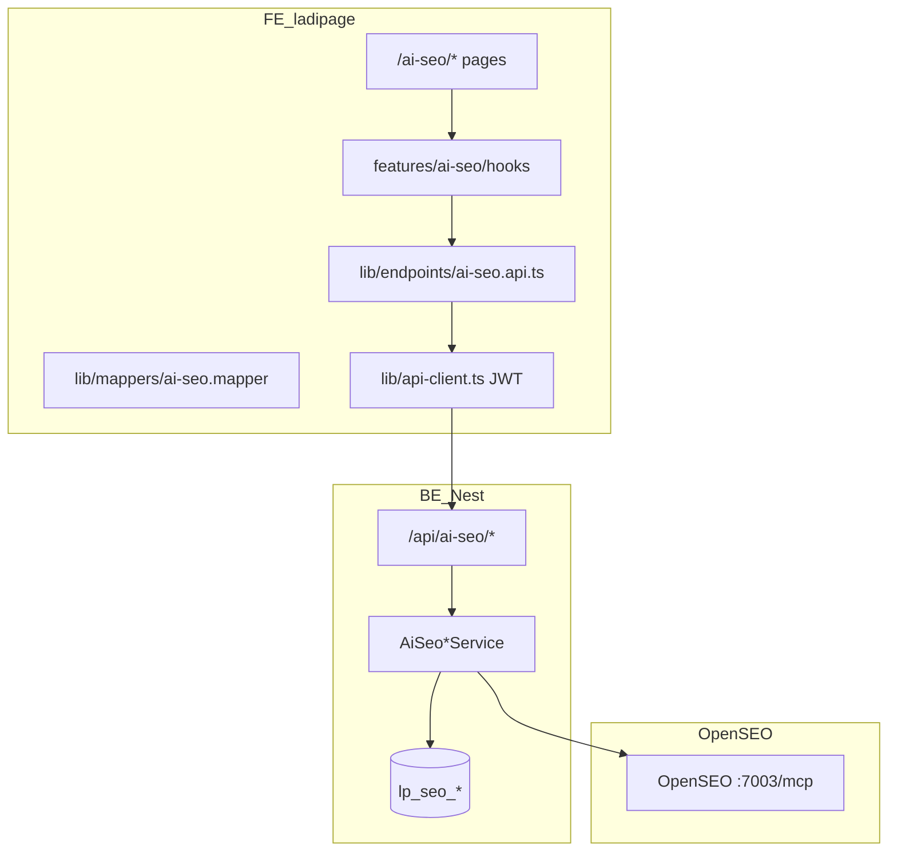

# Kế hoạch đấu nối — AI SEO (OpenSEO)

> **Ngày:** 2026-07-02 (cập nhật triển khai 2026-07-02)
> **Phạm vi:** Module `/ai-seo/*` — dashboard, landing pages, scan, tasks, integrations, builder connect  
> **BE:** `liora-monorepo/apps/ladipage-backend/src/modules/ai-seo/` → Nest `/api/ai-seo/*`  
> **Microservice:** OpenSEO Docker `:7003` (MCP adapter)  
> **Tham chiếu BE plan:** `liora-monorepo/docs/Kho-ung-dung/plan-be-ai-seo-openseo.md`

---

## 0. Hiện trạng (audit)

### Tiến độ tổng quan

| Layer | Hoàn thành | Ghi chú |
|-------|------------|---------|
| **BE core** (projects, landing, scan, tasks, jobs) | **~88%** | 37 files module, 2 migration, 7 unit/contract test pass |
| **BE parity 39 route FE BFF** | **~72%** | Thiếu conversations, runs, `PATCH seo-tasks/:id` |
| **FE đấu nối Nest** | **0%** | Vẫn gọi Next BFF `/api/ai-seo/*` |
| **E2E OpenSEO thật** | **0%** | Cần `DATAFORSEO_API_KEY` + `docker:up` + migration |

### FE v2 (`ladipage-fe-v2`)

| Thành phần | Path | Trạng thái |
|------------|------|------------|
| Routes UI | `app/(admin)/ai-seo/**` | UI hoàn chỉnh (~10 pages) |
| Feature module | `features/ai-seo/` | Components, hooks, stores, validation |
| API clients (cũ) | `features/ai-seo/api/*.api.ts` | **7 files** — `fetch('/api/ai-seo/...')` Next BFF |
| Next BFF | `app/api/ai-seo/**` | **39 routes** — Supabase + `mockDb` |
| HTTP client chuẩn | `lib/api-client.ts` | ✅ JWT Nest — **chưa dùng cho AI-SEO** |
| Endpoints layer | `lib/endpoints/ai-seo.api.ts` | **✅ S1** |
| Mapper | `lib/mappers/ai-seo.mapper.ts` | **✅ S1** (+ test) |
| api-types | `packages/@liora/api-types/src/ai-seo.ts` | **✅ S0** |
| Feature flag | `NEXT_PUBLIC_AI_SEO_USE_NEST` | **✅ S0** |
| App registry | `config/app-registry.ts` | `AiSeo` code, route `/ai-seo` |

**Hành vi hiện tại:** FE gọi Next BFF same-origin → BFF đọc Supabase `landing_pages` / `mockDb`. Một số call đã gửi Supabase JWT (`aiSeoProjects.api.ts`) nhưng BFF không forward sang Nest.

**Vấn đề cần fix khi migrate:**

- Bỏ `x-org-id` / query `orgId` — tenant lấy từ JWT (`TenantGuard`)
- `SeoProjectDto` BE dùng `isEngaged` — FE card dùng `agentStatus: 'engaged' | 'disengaged'`
- Job poll FE expect `success | failed | cancelled` — BE trả `done | running | ...`
- GSC connect BE trả `{ url, provider, projectId }` — FE chỉ cần `url`

### BE (`liora-monorepo/apps/ladipage-backend`)

| Thành phần | Path | Trạng thái |
|------------|------|------------|
| Module | `modules/ai-seo/` | ✅ 37 files |
| Controllers | 7 controllers | projects, tasks, jobs, integrations, keywords, agents, website-projects |
| DB | `lp_seo_project`, `lp_seo_task`, `lp_seo_project_page`, … | ✅ 2 migration |
| OpenSEO client | `services/openseo-client.service.ts` | ✅ MCP wrapper |
| Docker | `docker/docker-compose.yml` → `openseo:7003` | ✅ cần env key |
| api-types | `libs/api-types/src/ai-seo.ts` | ✅ chưa sync FE |
| Publish hook | `PublishService.onLandingPagePublished()` | ✅ skeleton |

### Gap chính

```
FE fetch('/api/ai-seo/*')     ≠  Nest GET localhost:7002/api/ai-seo/*
FE orgId / x-org-id            ≠  TenantGuard (JWT tenant)
FE AiSeoProjectListItem        ≠  SeoProjectDto (cần mapper)
FE conversations BFF           ≠  BE chưa có (giữ BFF phase 3)
```

---

## 1. Nguyên tắc đấu nối

Theo `plans/BE-INTEGRATION.md`:

```
ladipage-backend/modules/ai-seo/dto/*.dto.ts   ← contract
        ↓
@liora/api-types (sync ai-seo.ts)
        ↓
src/lib/endpoints/ai-seo.api.ts
        ↓
src/lib/mappers/ai-seo.mapper.ts
        ↓
features/ai-seo/hooks/*.ts
        ↓
features/ai-seo/components/** + app/(admin)/ai-seo/**
```

| Quy tắc | Chi tiết |
|---------|----------|
| **Input** | Khớp BE DTO (`CreateSeoProjectDto`: `hostname` required, `name?`, `landingPageId?`) |
| **Output** | Mapper FE → `AiSeoProjectListItem`, `AiSeoProjectPage`, … |
| **Auth** | `apiGet/apiPost` qua `api-client.ts` — Bearer JWT Nest |
| **Không gửi orgId** | Bỏ `x-org-id`, query `?orgId=` |
| **UI** | Giữ layout/components — chỉ đổi data layer |
| **Feature flag** | `NEXT_PUBLIC_AI_SEO_USE_NEST` toggle từng phase |

### Env dev

```env
NEXT_PUBLIC_API_URL=http://localhost:7002/api
NEXT_PUBLIC_AI_SEO_USE_NEST=true
# BFF fallback khi false (migrate dần):
# NEXT_PUBLIC_AI_SEO_USE_NEST=false
```

### Kiến trúc mục tiêu



---

## 2. Ma trận route — FE BFF ↔ BE Nest

| # | FE BFF (hiện tại) | BE Nest | Phase FE |
|---|-------------------|---------|----------|
| 1 | `GET/POST /projects` | ✅ | S2 |
| 2 | `PATCH/DELETE /projects/:id` | ✅ | S2 |
| 3 | `PATCH /projects/:id/favorite` | ✅ | S2 |
| 4 | `PATCH /projects/:id/agent-status` | ✅ | S2 |
| 5 | `POST /projects/:id/scan` | ✅ | S4 |
| 6 | `GET/POST/DELETE /projects/:id/landing-pages` | ✅ | S3 |
| 7 | `POST .../landing-pages/:pageId/scan` | ✅ | S3 |
| 8 | `GET .../scores`, `.../tasks` | ✅ | S3 |
| 9 | `GET/POST /seo-projects/*` | ✅ | S2 |
| 10 | `GET /seo-projects/:id/tasks` | ✅ | S5 |
| 11 | `POST /seo-tasks/:id/approve\|reject\|deploy` | ✅ | S5 |
| 12 | `PATCH /seo-tasks/:id` | ❌ BE | S5 (+ PR BE nhỏ) |
| 13 | `GET /jobs/:id`, `/jobs/:id/events` | ✅ | S4 |
| 14 | `GET /integrations/google/gsc\|gbp/*` | ✅ | S6 |
| 15 | `GET /website-projects/*` | ✅ | S3 |
| 16 | `GET /agents` | ✅ | S7 |
| 17 | `GET/POST /conversations/*` | ❌ BE | S7 — giữ BFF |
| 18 | `GET /runs/:id/tool-calls` | ❌ BE | S7 — giữ BFF |

**Coverage:** 28/39 route (~72%) — đủ cho **~90% user flow** (dashboard + landing + scan + tasks).

---

## 3. Mapper BE → FE (bắt buộc)

File: `src/lib/mappers/ai-seo.mapper.ts`

### `SeoProjectDto` → `AiSeoProjectListItem`

| BE (`SeoProjectDto`) | FE (`AiSeoProjectListItem`) |
|----------------------|----------------------------|
| `id` | `id`, `uuid`, `projectId` |
| `hostname` | `hostname`, `domain` |
| `isEngaged` | `agentStatus`: `engaged` \| `disengaged` |
| `holisticScores` + `aiGradeOverall` | `scores.graderScore`, `technicalScore`, … |
| `connectedData.isGscConnected` | `gscConnected` |
| `connectedData.isGbpConnected` | `gbpConnected` |
| `pixelTagState` | `pixelTagState`, `installationStatus` |
| `taskStatus` | `taskStatus`, `processingStatus` |
| `afterSummary` | `scores.healthyPages`, `scores.totalPages` |

### Job status normalize

```typescript
function mapJobStatus(beStatus: string): 'queued' | 'running' | 'success' | 'failed' {
  if (['done', 'completed', 'complete', 'success'].includes(beStatus)) return 'success'
  if (['failed', 'error'].includes(beStatus)) return 'failed'
  if (['running', 'started', 'pending'].includes(beStatus)) return 'running'
  return 'queued'
}
```

---

## 4. Lộ trình PR — FE

**Tổng effort:** ~8–9 ngày  
**Branch:** `feature/ai-seo-nest-integration`

### Phase 0 — Chuẩn bị (0.5 ngày) — PR-FE-S0

| Task | File | Deliverable |
|------|------|-------------|
| Sync api-types | `packages/@liora/api-types/src/ai-seo.ts` | Copy từ `liora-monorepo/.../libs/api-types/src/ai-seo.ts` |
| Export index | `packages/@liora/api-types/src/index.ts` | `export * from './ai-seo'` |
| Feature flag util | `features/ai-seo/utils/ai-seo-api-mode.ts` | `useNestApi(): boolean` |
| Env doc | `.env.example` | `NEXT_PUBLIC_AI_SEO_USE_NEST` |

**Verify:** `pnpm tsc --noEmit` pass sau sync types.

---

### Phase 1 — HTTP layer (1 ngày) — PR-FE-S1

| Task | File |
|------|------|
| Tạo endpoints | `src/lib/endpoints/ai-seo.api.ts` |
| Tạo mapper | `src/lib/mappers/ai-seo.mapper.ts` |
| Unit test mapper | `src/lib/mappers/ai-seo.mapper.test.ts` |

**`aiSeoApi` methods (tối thiểu):**

```typescript
export const aiSeoApi = {
  // Projects
  listProjects(params?: { page?: number; favorite?: boolean }),
  createProject(body: { hostname: string; name?: string; landingPageId?: string }),
  getProject(id: string),
  updateProject(id, string, body),
  deleteProject(id: string),
  toggleFavorite(id: string),
  toggleAgent(id: string),
  scanProject(id: string, depth?: 'quick' | 'full'),

  // Landing pages
  listLandingPages(projectId: string),
  linkLandingPage(projectId, body: { pageUrl: string; websitePageId?: string; source?: string }),
  unlinkLandingPage(projectId, pageId: string),
  scanLandingPage(projectId, pageId: string),

  // Jobs
  getJob(jobId: string),
  getJobEvents(jobId: string),

  // Tasks
  listTasks(projectId: string),
  approveTask(taskId: string),
  rejectTask(taskId: string),
  deployTask(taskId: string),

  // Integrations
  getGscConnectUrl(projectId: string),
  getGbpConnectUrl(projectId: string),

  // Website builder
  listWebsiteProjects(),
  listWebsitePages(websiteProjectId: string),
  publishWebsitePage(websiteProjectId, pageId: string),
  connectWebsitePageToAiSeo(websiteProjectId, pageId, aiSeoProjectId: string),

  // Agents
  listAgents(),
}
```

**Pattern:** dùng `apiGet`, `apiPost`, `apiPatch`, `apiDelete` từ `lib/api-client.ts` (giống `application.api.ts`).

---

### Phase 2 — Dashboard projects (1.5 ngày) — PR-FE-S2

| File cần sửa | Thay đổi |
|--------------|----------|
| `features/ai-seo/api/aiSeoProjects.api.ts` | Delegate → `aiSeoApi` + mapper |
| `features/ai-seo/api/projects.api.ts` | Deprecate hoặc redirect |
| `hooks/useAiSeoProjects.ts` | Bỏ `orgId` dependency thật |
| `hooks/useAiSeoProjectMutations.ts` | Dùng `aiSeoApi` |
| `components/projects/CreateProjectWizard.tsx` | POST `{ hostname, name }` — đã đúng |
| `app/(admin)/ai-seo/projects/page.tsx` | Smoke test |

**Pages:**

- `/ai-seo` — dashboard overview
- `/ai-seo/projects` — list cards
- `/ai-seo/projects/create` — wizard

**DoD:**

- [ ] `GET /api/ai-seo/projects` qua Nest (Network tab)
- [ ] Create project với `hostname` required
- [ ] Toggle favorite / agent hoạt động
- [ ] Delete project → `{ success: true }`

---

### Phase 3 — Landing pages + Builder (1.5 ngày) — PR-FE-S3

| File | Endpoint Nest |
|------|---------------|
| `api/landing-pages.api.ts` | `/ai-seo/projects/:id/landing-pages` |
| `hooks/useLandingPageQueries.ts` | Giữ query keys, đổi api layer |
| `components/landing-pages/*` | Không đổi UI |
| `ConnectLandingPageModal.tsx` | `linkLandingPage` |

**Website builder flow:**

```
GET /website-projects
  → GET /website-projects/:id/pages
  → POST .../publish (auto ensureForLandingPage BE)
  → POST .../connect-ai-seo
```

**Pages:** `/ai-seo/projects/[projectId]/landing-pages`

**DoD:**

- [ ] Link/unlink landing page
- [ ] List `AiSeoProjectPage` shape đúng (scores fields)
- [ ] Publish builder page → SEO project auto-create (BE)

---

### Phase 4 — Jobs polling + Scan (1 ngày) — PR-FE-S4

| File | Thay đổi |
|------|----------|
| `api/jobs.api.ts` | Nest + `mapJobStatus` |
| `hooks/useJobPolling.ts` | Nhận `success` từ mapper |
| `components/SeoProjectScanButton.tsx` | `scanProject` → poll `jobId` |

**BE đồng bộ (PR BE nhỏ, song song):**

- `AiSeoJobsService.getJob()` trả `status: 'success' | 'running' | 'failed'` chuẩn FE

**DoD:**

- [ ] Scan → `{ jobId, status: 'running' }`
- [ ] Poll dừng khi `success`
- [ ] Scores card refresh sau scan

---

### Phase 5 — Tasks workflow (1 ngày) — PR-FE-S5

| File | Endpoint |
|------|----------|
| `api/seo-tasks.api.ts` | `/ai-seo/seo-projects/:id/tasks` |
| `api/seo-projects.api.ts` | Redirect hoặc merge vào `aiSeoApi` |
| `hooks/useSeoTaskQueries.ts` | approve/reject/deploy POST |
| `components/tasks/TaskBoard.tsx` | Verify |

**BE bổ sung:** `PATCH /ai-seo/seo-tasks/:id` cho `updateSeoTask(status)`.

**Pages:** `/ai-seo/projects/[projectId]/tasks`

**DoD:**

- [ ] List tasks
- [ ] Approve → Deploy flow
- [ ] Task drawer landing page

---

### Phase 6 — Integrations GSC/GBP (0.5 ngày) — PR-FE-S6

| File | Thay đổi |
|------|----------|
| `api/integrations.api.ts` | Nest connect-url |
| `components/GscGbpConnectModal.tsx` | `response.url` |

**OAuth callback:** Giữ route FE callback page → forward query params sang `GET /api/ai-seo/integrations/google/gsc/callback`.

**Pages:** `/ai-seo/projects/[projectId]/installation`

---

### Phase 7 — Agents + Chat (1 ngày) — PR-FE-S7

| Màn | Chiến lược |
|-----|------------|
| Agents list | Wire `GET /api/ai-seo/agents` → Nest ✅ |
| `/ai-seo/chat` conversations | **Giữ Next BFF** (`NEXT_PUBLIC_AI_SEO_CHAT_USE_BFF=true`) |
| `runs/tool-calls` | Giữ BFF cho `ToolExecutionTimeline` |

**Pages:** `/ai-seo/chat`, `/ai-seo/playbooks`, `/ai-seo/history`

---

### Phase 8 — Deprecate BFF + QA (1 ngày) — PR-FE-S8

| Task | Chi tiết |
|------|----------|
| Xóa BFF đã migrate | `app/api/ai-seo/projects`, `landing-pages`, `jobs`, … |
| Giữ BFF | `conversations/`, `runs/` (đến khi BE có) |
| Xóa phụ thuộc | `mockDb.ts` references trong hooks đã migrate |
| E2E manual | create → scan → poll → scores → link landing |

**Checklist QA:**

```bash
# BE phải chạy
cd liora-monorepo && pnpm db:migration:run && pnpm docker:up

# FE
cd ladipage-fe-v2 && NEXT_PUBLIC_AI_SEO_USE_NEST=true pnpm dev

# Smoke
# Login → /ai-seo/projects → Create → Scan → Landing pages
```

---

## 5. File inventory — cần tạo / sửa

### Tạo mới

| File | Phase |
|------|-------|
| `packages/@liora/api-types/src/ai-seo.ts` | S0 |
| `src/lib/endpoints/ai-seo.api.ts` | S1 |
| `src/lib/mappers/ai-seo.mapper.ts` | S1 |
| `src/lib/mappers/ai-seo.mapper.test.ts` | S1 |
| `src/features/ai-seo/utils/ai-seo-api-mode.ts` | S0 |

### Sửa (theo phase)

| File | Phase |
|------|-------|
| `features/ai-seo/api/aiSeoProjects.api.ts` | S2 |
| `features/ai-seo/api/landing-pages.api.ts` | S3 |
| `features/ai-seo/api/jobs.api.ts` | S4 |
| `features/ai-seo/api/seo-tasks.api.ts` | S5 |
| `features/ai-seo/api/integrations.api.ts` | S6 |
| `features/ai-seo/api/seo-projects.api.ts` | S5 |
| `features/ai-seo/hooks/useAiSeoQueries.ts` | S7 |
| `features/ai-seo/hooks/*` (7 hooks) | S2–S5 |

### Xóa / deprecate (S8)

| Path | Khi nào |
|------|---------|
| `app/api/ai-seo/projects/**` | Sau S2 verified |
| `app/api/ai-seo/landing-pages/**` | Sau S3 |
| `app/api/ai-seo/jobs/**` | Sau S4 |
| `app/api/ai-seo/seo-tasks/**` | Sau S5 |
| `app/api/ai-seo/mockDb.ts` | Cuối S8 (nếu không còn BFF dùng) |

---

## 6. Phụ thuộc BE (blockers)

| Blocker | Ảnh hưởng | Owner | ETA |
|---------|-----------|-------|-----|
| Migration chưa chạy staging | 500 DB errors | DevOps | Trước S2 |
| `DATAFORSEO_API_KEY` trống | Scan/keyword fail | DevOps | Trước S4 |
| Job status shape | Poll không dừng | BE | S4 (0.5d) |
| `PATCH seo-tasks/:id` | updateSeoTask broken | BE | S5 (0.5d) |
| Conversations API | Chat page | BE phase 3 | Sau S8 |

---

## 7. Rủi ro & giảm thiểu

| Rủi ro | Giảm thiểu |
|--------|------------|
| FE card crash vì thiếu field | Mapper defensive defaults |
| Migrate một phần — 2 nguồn data | Feature flag `NEXT_PUBLIC_AI_SEO_USE_NEST` per module |
| OpenSEO down khi scan | FE hiện error từ Nest 503 + retry UI |
| orgId hardcode `"org-1"` | Gỡ dần; hooks giữ param cosmetic đến S8 |

---

## 8. Tham chiếu

| Tài liệu | Path |
|----------|------|
| BE plan đầy đủ | `liora-monorepo/docs/Kho-ung-dung/plan-be-ai-seo-openseo.md` |
| BE prompt implement | `liora-monorepo/docs/Kho-ung-dung/prompt-be-ai-seo-openseo.md` |
| Nguyên tắc FE integrate | `ladipage-fe-v2/plans/BE-INTEGRATION.md` |
| App store (catalog AiSeo) | `ladipage-fe-v2/plans/APP-STORE-INTEGRATION.md` |
| BE DTO source | `liora-monorepo/apps/ladipage-backend/src/modules/ai-seo/dto/` |
| BE api-types | `liora-monorepo/apps/ladipage-backend/libs/api-types/src/ai-seo.ts` |
| FE types UI | `src/features/ai-seo/types/index.ts` |
| Pattern endpoints | `src/lib/endpoints/application.api.ts` |

---

## 9. Tóm tắt timeline

| Tuần | PR | Kết quả |
|------|-----|---------|
| W1 D1–2 | S0 + S1 | api-types + `aiSeoApi` + mapper |
| W1 D3–4 | S2 | Dashboard projects live trên Nest |
| W1 D5 | S3 | Landing pages + builder connect |
| W2 D1 | S4 | Scan + job polling |
| W2 D2 | S5 | Tasks board |
| W2 D3 | S6 | GSC/GBP |
| W2 D4 | S7 | Agents (chat giữ BFF) |
| W2 D5 | S8 | Deprecate BFF core + QA |

**Sau S8:** AI-SEO core chạy 100% qua Nest; chat/conversations chờ BE phase 3.