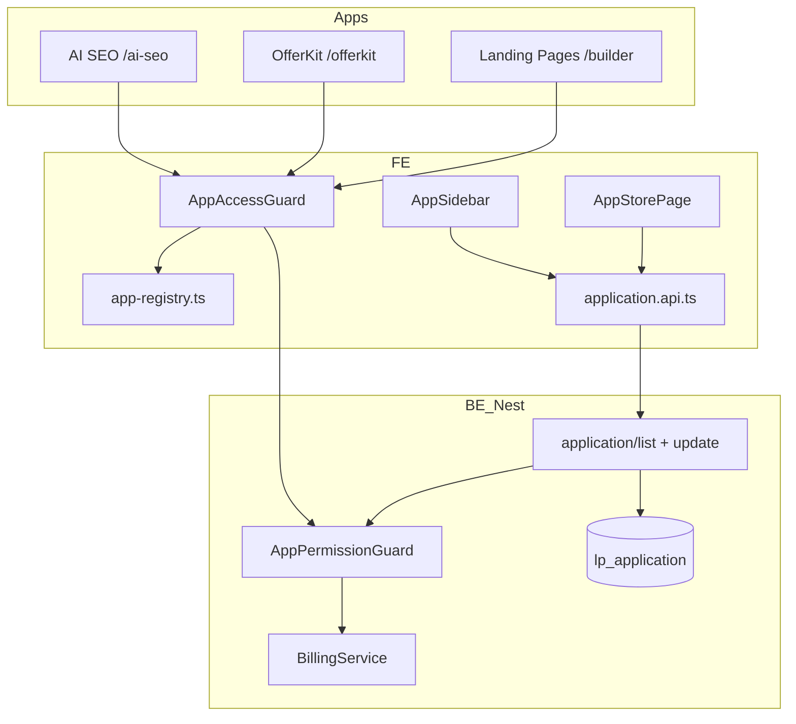
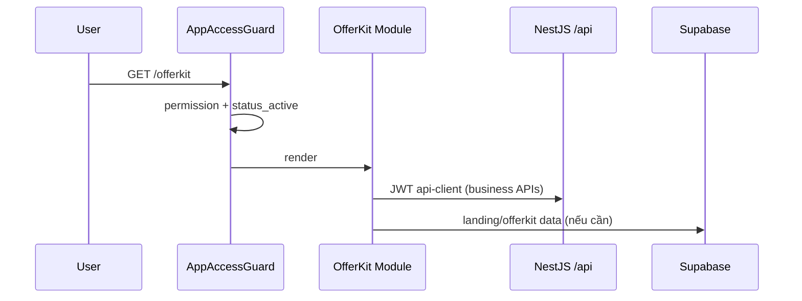

# Kế hoạch đấu nối — Kho ứng dụng (App Store)

> **Ngày:** 2026-06-29  
> **Phạm vi:** `/kho-ung-dung` + sidebar apps + route guards  
> **Tham chiếu appv6:** `POST /2.0/application/list`, `POST /2.0/application/update`

---

## 0. Hiện trạng (audit)

### FE v2 (`ladipage-fe-v2`)

| Thành phần | Path | Trạng thái |
|------------|------|------------|
| Route | `app/(admin)/kho-ung-dung/page.tsx` | UI hoàn chỉnh |
| Page logic | `features/app-store/AppStorePage.tsx` | **100% client mock** |
| Catalog static | `features/app-store/data/app-catalog.ts` | 14 apps, giá string |
| Install state | `features/app-store/storage/app-installation.ts` | **localStorage** |
| Sidebar filter | `layout/AppSidebar.tsx` | Ẩn menu theo `appId` + localStorage |
| Types | `features/app-store/types.ts` | `id` string, `price` display string |
| Billing UI | Nút "Nâng cấp ngay" | **Không có onClick** |
| API layer | `lib/endpoints/application.api.ts` | **Chưa có** |

**Hành vi install hiện tại:** thêm `id` vào localStorage → set `INSTALLED` → pin sidebar. **Không gọi BE.**

**Route guard:** Không có — truy cập trực tiếp `/offerkit`, `/ai-seo` vẫn mở được dù chưa "cài".

### BE (`liora-monorepo/apps/ladipage-backend`)

| Thành phần | Path | Trạng thái |
|------------|------|------------|
| Module | `modules/app-store/` | Có |
| List catalog | `ApplicationCatalogService` → `application/list` | RPC + seed/DB |
| Lifecycle | `ApplicationLifecycleService` → `application/update` | Patch `status_active`, `status_pin` |
| Entity | `entities/application.entity.ts` → `lp_application` | Có |
| Types | `libs/ladipage-types/.../application.types.ts` → `LpApplication` | `code`, `price`, `status_active`, `status_pin` |
| Entry | `POST /ladipage/application/list\|update` | RPC public/bypass hiện tại |
| Billing gate | — | **Chưa có** trên install/activate |
| RBAC gate | — | **Chưa có** trên app-store |

**BE catalog (fixture Phase A):** 7 apps legacy — `WebsiteBuilder`, `Ecommerce`, `Automation`, `LadiWork`, …  
**FE catalog:** 14 apps — thêm OfferKit, CloudPhone, Facebook Ads, SearchAtlas suite (id 17–23).

### Gap chính

```
FE id "15" (OfferKit)  ≠  BE code "Ecommerce"
FE localStorage        ≠  BE status_active / status_pin
FE static price string ≠  BE price (number VND)
No permission check    ≠  account/permissions + billing tier
```

---

## 1. Kiến trúc mục tiêu



### Nguồn sự thật (source of truth)

| Dữ liệu | Lưu ở đâu | Ghi chú |
|---------|-----------|---------|
| Catalog master (code, name, price, logo) | **BE `lp_application`** + seed mở rộng | Sync appv6 |
| Mapping FE ↔ BE | **FE `app-registry.ts`** | `feId`, `code`, `route`, `apiBaseUrl?` |
| Trạng thái cài/pin | **BE `status_active`, `status_pin`** | Thay localStorage |
| Quyền user (RBAC) | **BE `/account/permissions`** | Đã có trong auth flow |
| Gói billing | **BE `/billing/usage`** | `subscriptionTier` |
| Metadata app v2-only | **FE registry** hoặc bảng `lp_application_extension` (BE phase 2b) | OfferKit, SearchAtlas |

---

## 2. PHASE 1 — Permission & phân quyền truy cập

**Mục tiêu:** Xác định user nào được **xem / cài / mở / cập nhật** app nào; app trả phí phải qua gate billing trước khi activate.

**Effort:** ~5–7 ngày (BE + FE song song)

### 2.1 Mô hình phân quyền (3 lớp)

| Lớp | Nguồn | Kiểm tra khi | Ví dụ từ chối |
|-----|-------|--------------|---------------|
| **L1 — RBAC** | `platform.permissions[]` từ `/account/permissions` | Mở route app, thao tác admin | User không có `app:offerkit:use` |
| **L2 — Billing tier** | `BillingUsageDto.subscriptionTier` + `app.price` | Install / Activate (`status_active: true`) | App `price > 0` + tier `free` → chặn, hiện upgrade |
| **L3 — App lifecycle** | `LpApplication.status_active` | Mở app từ sidebar / deep link | App chưa activate → redirect `/kho-ung-dung?app={id}` |

**Thứ tự evaluate:** L3 (đã cài?) → L1 (có quyền?) → L2 (đủ gói?) → cho phép.

### 2.2 Ma trận quyền đề xuất

| App (code) | Permission key | Min tier | price BE (VND) | Ghi chú |
|------------|----------------|----------|----------------|---------|
| `WebsiteBuilder` | `app:website:use` | free | 0 | Landing Pages |
| `Ecommerce` | `app:ecom:use` | free | 0 | Bán hàng |
| `Automation` | `app:automation:use` | pro | 0 | Dynamic |
| `LadiWork` | `app:office:use` | pro | 0 | Office |
| `OfferKit` | `app:offerkit:use` | pro | 2400000 | FE id `15` |
| `CloudPhone` | `app:cloudphone:use` | pro | 0 | FE id `14` |
| `FacebookAds` | `app:fbads:use` | free | 0 | Extension bridge |
| `AiSeo` | `app:aiseo:use` | pro | 1500000 | SearchAtlas suite |
| `SiteMetrics` | `app:metrics:use` | free | 0 | |
| `Local` | `app:local:use` | pro | 800000 | |
| `Content` | `app:content:use` | pro | 1500000 | |
| `Keywords` | `app:keywords:use` | free | 0 | |
| `Reports` | `app:reports:use` | free | 0 | |
| `Authority` | `app:authority:use` | enterprise | 0 | Sắp ra mắt |

> Permission keys là đề xuất — cần align với menu module BE (`System - 菜单权限模块`) khi có danh sách chính thức từ appv6.

### 2.3 PR BE — Phase 1

| # | Task | Chi tiết |
|---|------|----------|
| BE-P1-01 | `AppPermissionGuard` | Inject `BillingService` + đọc permissions từ JWT/tenant context |
| BE-P1-02 | Gate `application/update` | Khi `status_active: true` và `price > 0` → check `subscriptionTier >= required` |
| BE-P1-03 | Gate `application/update` | Check permission key theo `code` (bảng map trong service) |
| BE-P1-04 | Response enrich | `application/list` trả thêm `can_install`, `can_open`, `upgrade_required`, `required_tier` |
| BE-P1-05 | RPC auth | Bỏ `@Public()` trên app-store RPC; yêu cầu `store-id` + Nest JWT (giống appv6 headers) |
| BE-P1-06 | Mở rộng seed | Thêm records OfferKit, CloudPhone, SearchAtlas apps vào fixture/DB |
| BE-P1-07 | Unit test | Activate paid app với tier free → 403; tier pro → 200 |

### 2.4 PR FE — Phase 1

| # | Task | File |
|---|------|------|
| FE-P1-01 | `app-registry.ts` | Map `feId ↔ code ↔ route ↔ permission ↔ minTier` |
| FE-P1-02 | `lib/access/app-access.ts` | `canOpenApp()`, `canInstallApp()`, `requiresUpgrade()` |
| FE-P1-03 | Hook `useAppAccess()` | Kết hợp `usePlatformAuth()` + `useBillingUsage()` |
| FE-P1-04 | `AppAccessGuard` component | Wrap layout `(admin)/offerkit`, `ai-seo`, … |
| FE-P1-05 | Middleware hoặc layout guard | Chặn deep link nếu L1/L3 fail |
| FE-P1-06 | `AppStorePage` | Disable install + hiện upgrade modal khi L2 fail |
| FE-P1-07 | Wire "Nâng cấp ngay" | → `billingApi.subscribe()` hoặc `UpgradeModal` |
| FE-P1-08 | `AppSidebar` | Filter theo `status_active` từ API (thay localStorage) + permission |
| FE-P1-09 | UI states | Badge: `Cần nâng cấp`, `Chưa cài`, `Không có quyền` |

### 2.5 Luồng Install có permission (Phase 1)

```
User bấm "Cài đặt"
  → canInstallApp(code)?
      ├─ NO permission → toast "Bạn không có quyền"
      ├─ NO tier + price>0 → mở UpgradeModal
      └─ YES → POST application/update { code, status_active: true, status_pin: true }
            → refresh list → sidebar cập nhật
```

### 2.6 Verify Phase 1

| Case | User | Kỳ vọng |
|------|------|---------|
| T1 | free tier, không permission OfferKit | Nút Cài disabled + message |
| T2 | free tier, có permission, app trả phí | Upgrade modal |
| T3 | pro tier (MSW mock) | Cài thành công, sidebar hiện |
| T4 | Đã cài, gỡ quyền RBAC | Deep link `/offerkit` → redirect + 403 UI |
| T5 | Chưa cài | `/offerkit` → redirect kho ứng dụng |

---

## 3. PHASE 2 — Catalog, Install, Update & lưu trữ apps

**Mục tiêu:** List apps từ BE; install/update qua API; mỗi app biết route và API base để gọi dịch vụ con.

**Effort:** ~7–10 ngày | **Phụ thuộc:** Phase 1 guards

### 3.1 Luồng render list apps

```
AppStorePage mount
  → useApplications() // React Query
      → applicationApi.list()
          → POST /ladipage/application/list { lang: "vi" }
              → ApplicationCatalogService
                  → lp_application (tenant + store_id)
  → merge với app-registry.ts (icon, category FE, route)
  → render AppCard[]
```

### 3.2 Luồng Install / Update / Uninstall

| Hành động FE | RPC body | BE field |
|--------------|----------|----------|
| Cài đặt | `{ code, status_active: true, status_pin: true }` | activate + pin sidebar |
| Gỡ cài | `{ code, status_active: false, status_pin: false }` | **BE-P2-01** thêm hỗ trợ deactivate |
| Chỉ bỏ pin | `{ code, status_pin: false }` | giữ active |
| Cập nhật metadata | `{ code, ... }` | phase sau |

### 3.3 Phương án lưu trữ apps — đề xuất hybrid

#### Tier A — Catalog & lifecycle (BE Postgres)

```
lp_application
  tenant_id, store_id, code, name, price,
  status_active, status_pin, logo, thumb,
  is_delete, created_at, updated_at
```

- Nguồn cho **list / install state**
- Đồng bộ contract appv6 (`LpApplication`)

#### Tier B — App Registry (FE code, versioned)

File: `src/config/app-registry.ts`

```typescript
export type AppRegistryEntry = {
  code: string;           // BE primary key
  feId: string;           // UI card id
  route: string;          // /offerkit, /ai-seo
  permission: string;     // app:offerkit:use
  minTier: PlanTier;
  apiBaseUrl?: string;    // Nest module base, nếu khác /api
  dataBackend?: "nestjs" | "supabase" | "external";
  iconName: AppItem["iconName"];
  category: AppItem["category"];
};
```

- Dùng cho **routing, guard, merge UI**
- Không duplicate price (lấy từ BE)

#### Tier C — Dữ liệu nghiệp vụ từng app (theo app)

| App | Data store | API gateway |
|-----|------------|-------------|
| Website Builder / Landing | **Supabase** `landing_pages` | Next BFF `/api/landing-pages` |
| OfferKit | **Supabase** + Nest khi có | `/api/offerkit` hoặc module riêng |
| Ecom / CRM | **Nest REST** `/api/ecom`, `/api/crm` | `api-client.ts` |
| AI SEO / SearchAtlas | **Supabase** + services | `/api/ai-seo` |
| Office | **Local / Pixi** | Không cần BE list |

**Nguyên tắc:** Kho ứng dụng chỉ quản **catalog + activate**; mỗi app tự gọi API backend của nó qua `apiBaseUrl` / `dataBackend` trong registry.

### 3.4 PR BE — Phase 2

| # | Task |
|---|------|
| BE-P2-01 | Hỗ trợ `status_active: false` (uninstall) |
| BE-P2-02 | REST wrapper `GET /api/applications`, `PATCH /api/applications/:code` (thay RPC thuần cho FE v2) |
| BE-P2-03 | Seed đủ 14 apps + `price` VND |
| BE-P2-04 | Optional: `lp_application_extension` (json metadata: tags, downloads count) |
| BE-P2-05 | Sync `@liora/api-types` → `ApplicationDto` enriched |

### 3.5 PR FE — Phase 2

| # | Task | File |
|---|------|------|
| FE-P2-01 | `lib/endpoints/application.api.ts` | list, update |
| FE-P2-02 | `features/app-store/hooks/useApplications.ts` | React Query |
| FE-P2-03 | Refactor `AppStorePage` | bỏ `initialApps` hardcode làm source chính |
| FE-P2-04 | Deprecate localStorage install | chỉ cache optimistic, reconcile API |
| FE-P2-05 | `handleOpen` dùng registry `route` | bỏ hardcoded id map |
| FE-P2-06 | Merge layer | `mergeBeApplicationWithRegistry(be, registry)` |
| FE-P2-07 | Error handling | RPC fail → fallback read-only catalog + banner |

### 3.6 Gọi API tới từng app sau khi cài



- **Shared auth:** `platform.nestToken` (đã có)
- **App entry:** registry `route` + lazy load module
- **Không** route business API qua `application/list`

### 3.7 Verify Phase 2

- [ ] List load từ BE, giá hiển thị đúng VND
- [ ] Install/uninstall sync sidebar không cần localStorage
- [ ] Reload page giữ trạng thái cài
- [ ] Mở app đúng route từ registry
- [ ] OfferKit gọi đúng API module (smoke test)

---

## 4. Báo cáo kết quả đạt được nếu triển khai

### Phase 1 hoàn thành

| KPI | Trước | Sau |
|-----|-------|-----|
| Install lưu server-side | 0% (localStorage) | 100% qua `application/update` |
| Deep link bảo vệ | 0% | 100% app có `AppAccessGuard` |
| Paid app gate | UI decorative | Enforce tier + upgrade flow |
| RBAC trên app | Không | Permission key per app |
| Đồng bộ sidebar | localStorage | `status_pin` + permission |

**Kết quả nghiệp vụ:**
- Admin kiểm soát được user nào dùng app nào (giống appv6 store-scopes)
- User free không activate app trả phí — giảm abuse, tăng conversion upgrade
- Security: không bypass bằng URL trực tiếp

### Phase 2 hoàn thành

| KPI | Trước | Sau |
|-----|-------|-----|
| Catalog single source | 2 catalog (FE 14, BE 7) | 1 BE + registry merge |
| ID mapping | Không | `feId ↔ code` chuẩn |
| Uninstall | FE only | BE `status_active: false` |
| Onboarding app mới | Sửa 3 file FE | Thêm seed BE + 1 dòng registry |

**Kết quả nghiệp vụ:**
- Kho ứng dụng vận hành được như appv6: list → cài → pin → mở
- Mỗi app có contract rõ `route` + `dataBackend` — team triển khai module độc lập
- Giảm drift giữa marketing catalog và BE thật

### Rủi ro & phụ thuộc

| Rủi ro | Giảm thiểu |
|--------|------------|
| Permission keys chưa có trên BE auth | Phase 1a: mock permissions trong JWT dev; Phase 1b: sync menu module |
| RPC vs REST | Wrapper REST song song, giữ RPC cho legacy |
| App v2-only chưa có trên appv6 | Registry FE + seed BE mở rộng |

---

## 5. Thứ tự PR đề xuất

| PR | Nội dung | Repo |
|----|----------|------|
| PR-A1 | App registry + access helpers | FE |
| PR-A2 | AppPermissionGuard + billing gate on update | BE |
| PR-A3 | application.api + useAppAccess + guards | FE |
| PR-A4 | AppStorePage wire + upgrade modal | FE |
| PR-A5 | REST /api/applications + uninstall + full seed | BE |
| PR-A6 | Replace localStorage + sidebar sync | FE |

---

## 6. Tài liệu tham chiếu

| File | Path |
|------|------|
| FE App Store | `src/features/app-store/` |
| FE Sidebar | `src/layout/AppSidebar.tsx` |
| BE Catalog | `modules/app-store/services/application-catalog.service.ts` |
| BE Lifecycle | `modules/app-store/services/application-lifecycle.service.ts` |
| Contract list | `test/contract/fixtures/phaseA/application__list.json` |
| Contract update | `test/contract/fixtures/phaseA/application__update.json` |
| LpApplication type | `libs/ladipage-types/src/landing/application.types.ts` |
| Billing FE | `src/lib/endpoints/billing.api.ts` |
| Auth permissions | `src/features/auth/services/platform-auth.service.ts` |

Báo cáo kết quả nếu triển khai
App Store
┌─────────────────────┬──────────────────────────────────┐
│ KPI                 │ Sau Phase 1+2                    │
├─────────────────────┼──────────────────────────────────┤
│ Install server-side │ 100% qua BE (không localStorage) │
├─────────────────────┼──────────────────────────────────┤
│ Deep link bảo vệ    │ Guard trên mọi app module        │
├─────────────────────┼──────────────────────────────────┤
│ Paid app abuse      │ Chặn + upgrade flow              │
├─────────────────────┼──────────────────────────────────┤
│ Catalog drift       │ 1 nguồn BE + registry merge      │
└─────────────────────┴──────────────────────────────────┘