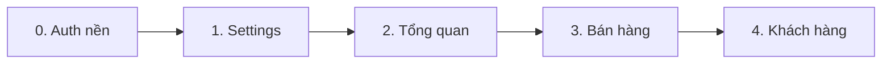

# Kế hoạch đấu nối BE — ladipage-fe-v2

> **Phạm vi:** Tổng quan · Bán hàng · Khách hàng · Settings  
> **Ngoài scope:** Billing, Analytics, Facebook Ads module  
> **Ngày cập nhật:** 2026-06-29

---

## 1. Nguyên tắc

### 1.1 BE là contract chuẩn (parity appv6.ladipage.com)

Thứ tự đọc khi implement:

```
ladipage-backend/src/modules/**/dto/*.dto.ts   ← validation thật
        ↓
@liora/api-types (sync từ liora-monorepo/libs/api-types)
        ↓
ladipage-fe-v2/src/lib/endpoints/*.api.ts
        ↓
features/*/hooks/*.ts
        ↓
page.tsx (+ chỉnh form input nếu lệch BE)
```

| Loại | Quy tắc |
|------|---------|
| **Input (POST/PUT/PATCH)** | Payload phải khớp BE DTO. FE form **được chỉnh** cho khớp |
| **Output (GET)** | Mapper format hiển thị (date VN, `id` string…) |
| **FE field chưa có BE** | **Giữ UI FE** → bổ sung logic BE (migration + DTO + service) theo contract appv6 |
| **Layout** | Giữ layout v2; chỉnh form fields / validation |

### 1.2 Quy trình mỗi form có input

1. Đọc BE `*.dto.ts`
2. Lập bảng **BE input ↔ FE hiện tại**
3. Nếu FE có field BE chưa có → **PR BE trước** (entity + migration + DTO + api-types sync)
4. Chỉnh FE form / `endpoints/*.api.ts` cho khớp
5. Wire hook + `page.tsx`
6. Verify Network tab → body khớp DTO

### 1.3 Hạ tầng FE đã có

| Layer | Path | Status |
|-------|------|--------|
| API types | `packages/@liora/api-types/` | Có — cần sync sau mỗi thay đổi BE |
| HTTP client | `src/lib/api-client.ts` | OK |
| Endpoints | `src/lib/endpoints/*.api.ts` | 8 modules |
| Mappers | `src/lib/mappers/{ecom,crm}.mapper.ts` | Một phần |
| Auth | `src/features/auth/*`, `middleware.ts` | Đã fix, build pass |
| MSW | `src/mocks/*` | `NEXT_PUBLIC_API_MOCK=true` |

### 1.4 Env dev

```env
NEXT_PUBLIC_API_BASE_URL=http://localhost:7002/api
NEXT_PUBLIC_API_MOCK=false
```

---

## 2. Thứ tự thực hiện



| Bước | Module | Effort | Ghi chú |
|------|--------|--------|---------|
| 0 | Auth nền | 0.5d | Prerequisite JWT |
| 1 | Settings | 1d | Form đơn giản |
| 2 | Tổng quan | 1d | Read-only |
| 3 | Bán hàng | 2–3d | Gồm **PR BE** cho `source` + `assignee` |
| 4 | Khách hàng | 1.5d | Chỉnh modal tag/segment → IDs |

**Tổng:** ~6–8 ngày

---

## 3. Bước 0 — Auth nền

**Mục tiêu:** Login → cookie JWT → `useAuthQueryEnabled()` cho mọi hook.

| Task | File | Status |
|------|------|--------|
| Captcha login | `SignInForm`, `platform-auth.service` | Cần verify E2E |
| Wire UserDropdown | `components/header/UserDropdown.tsx` | `usePlatformAuth()` + logout |
| Middleware public routes | `middleware.ts` | `/p/*`, `/templates/*`, `/education/*` |

**BE input login** (`LoginPayload`): `email*`, `password*`, `captchaId*`, `verifyCode*` — giữ theo v1.

**Verify:** `pnpm run test:login-session`

---

## 4. Module 1 — Settings

**Route:** `app/(admin)/facebook-ads/cai-dat/page.tsx`  
**Tách biệt:** `components/settings/Settings.tsx` (claw — theme + 4 FB token local) **không đụng**

### 4.1 BE input contract

**`PUT /api/settings/workspace`** — `UpdateWorkspaceSettingsDto`:

| Field | Max | FE form |
|-------|-----|---------|
| `name` | 255 | input |
| `logo` | — | optional |
| `timezone` | 100 | select IANA |
| `locale` | 20 | select |
| `description` | — | textarea |

**`PUT /api/settings/integrations`** — `UpdateIntegrationsSettingsDto`:

| Field | FE form |
|-------|---------|
| `facebook.token` | 1 input (eaag) |
| `facebook.pageId` | input |
| `zalo.token`, `zalo.oaId` | defer |

> BE **không nhận** `configured`, `eaab/eaai/eaah`, `cookie`.

### 4.2 Mismatch & hành động

| ID | FE | BE | Hành động |
|----|----|----|-----------|
| S-01 | claw: 4 FB tokens local | `facebook.token` only | `WorkspaceSettings` sync 1 token; claw giữ local |
| S-02 | Không có workspace form | `name, timezone…` | Thêm form |
| S-03 | Theme | không có API | `localStorage` only |

### 4.3 Tasks

| # | Task | File |
|---|------|------|
| 1.1 | Copy `useSettings.ts` | `features/settings/hooks/` |
| 1.2 | Copy `ApiState.tsx` | `components/common/` |
| 1.3 | Tạo `WorkspaceSettings.tsx` | `components/workspace-settings/` |
| 1.4 | Wire `cai-dat/page.tsx` | → `<WorkspaceSettings />` |

### 4.4 Verify

- [ ] Load/save workspace name + timezone
- [ ] Save `facebook.token` persist qua BE
- [ ] claw Settings vẫn hoạt động độc lập

---

## 5. Module 2 — Tổng quan

**Route:** `app/(admin)/page.tsx`  
**Loại:** Read-only — không chỉnh form input

### 5.1 BE output

**`GET /api/dashboard/summary`** → `DashboardSummaryDto`:

```
ordersToday, pendingOrders, revenueToday, totalCustomers,
newCustomersThisWeek, recentOrders[], revenueChart, subscription?
```

**`GET /api/dashboard/onboarding`** → `OnboardingDto`:

```
steps: { id, title, completed }[]
progressPercent, completedCount, totalCount
```

BE onboarding steps: `has_product`, `has_customer`, `has_order`, `has_completed_order`, `has_segment`

### 5.2 Mismatch & hành động

| ID | FE v2 | BE | Hành động |
|----|-------|-----|-----------|
| D-01 | `stepsData` marketing static (4 tab) | `OnboardingDto` 5 bước vận hành | **Hybrid:** progress bar = `progressPercent` BE; roadmap marketing giữ static |
| D-02 | Greeting hardcoded | `platform.profile` | Wire `usePlatformAuth()` |
| D-03 | KPI mock | `DashboardSummaryDto` | Wire `useDashboardSummary()` |
| D-04 | Bottom tab mock | không có API | Giữ static |

### 5.3 Tasks

| # | Task |
|---|------|
| 2.1 | Copy `useDashboard.ts` |
| 2.2 | Wire greeting + KPI cards |
| 2.3 | Wire progress bar từ `onboarding.progressPercent` |
| 2.4 | Optional: `recentOrders` + `revenueChart` |

### 5.4 Verify

- [ ] Tạo order/customer trên BE → KPI đổi sau refresh
- [ ] Progress % khớp checklist BE

---

## 6. Module 3 — Bán hàng

**Route:** `app/(admin)/ban-hang/page.tsx`  
**Tab ưu tiên:** `orders` (sub-tabs defer sau khi orders ổn)

### 6.1 BE input contract hiện tại

**`POST /api/ecom/orders`** — `CreateOrderDto`:

| Field | Required | Ghi chú |
|-------|----------|---------|
| `customerName` | yes | max 255 |
| `customerPhone` | yes | max 30 |
| `customerEmail` | no | email |
| `paymentMethod` | no | string |
| `notes` | no | string |
| `isIncomplete` | no | boolean |
| `status` | no | OrderStatus enum |
| `items` | yes | `CreateOrderItemDto[]` |
| `tagIds` | no | number[] |

**`CreateOrderItemDto`:** `productName*`, `quantity*`, `unitPrice*`, `productId?`

**`PATCH /api/ecom/orders/:id/status`:** `{ status: OrderStatus }`

**Response list** (`toListItem`): `id` = code (DH1001), `orderId` = numeric PK

### 6.2 Contract appv6 (tham chiếu mở rộng BE)

Từ `test/contract/fixtures/phase2/order__show.json`:

| appv6 field | Ý nghĩa | FE v2 field |
|-------------|---------|-------------|
| `source` | Kênh bán hàng ("Landing Page", …) | `salesChannel` |
| `assignee_id` | UUID nhân viên phụ trách | `staff` (khi có staff API) |
| `creator_id` | Người tạo | auto từ JWT tenant user |
| `note` | Ghi chú nội bộ | `internalNote` → `notes` |

### 6.3 ★ E-01 / E-02 — Giữ FE, bổ sung BE

> **Quyết định:** Không xóa `salesChannel` và `staff` khỏi `CreateOrderModal`.  
> BE chưa có logic → **PR BE bắt buộc** trước khi wire create order E2E.

#### 6.3.1 FE giữ nguyên (không xóa field)

`CreateOrderModal.tsx` giữ:

| FE field | UI | Giá trị mẫu |
|----------|-----|-------------|
| `salesChannel` | select "Kênh bán hàng" | Landing Page / Website / Facebook Ads |
| `staff` | select "Nhân viên phụ trách" | Chưa có người phụ trách / tên NV |
| `internalNote` | textarea | → map `notes` (đã có BE) |
| `paymentMethod` | select | COD / Chuyển khoản |

#### 6.3.2 PR BE — Thêm field order (parity appv6)

**Repo:** `liora-monorepo/apps/ladipage-backend`

| # | Task | File / chi tiết |
|---|------|-----------------|
| BE-01 | Migration thêm cột | `lp_order`: `source VARCHAR(100) NULL`, `assignee_id VARCHAR(36) NULL`, `assignee_name VARCHAR(255) NULL` |
| BE-02 | Entity | `order.entity.ts` — 3 columns trên |
| BE-03 | DTO input | `CreateOrderDto` thêm: `source?` (max 100), `assigneeId?` (max 36), `assigneeName?` (max 255) |
| BE-04 | Service create | `order.service.ts` — persist 3 field khi create |
| BE-05 | Response list/detail | `toListItem()` trả thêm `source`, `assigneeId`, `assigneeName` |
| BE-06 | api-types | `libs/api-types/src/ecom.ts` — mở rộng `OrderItem` |
| BE-07 | Sync FE types | Copy/sync sang `ladipage-fe-v2/packages/@liora/api-types` |
| BE-08 | Unit test | create order có `source` + `assigneeName` → detail khớp |

**Mapping tên field API (camelCase REST):**

```
FE salesChannel  →  BE DTO source        (khớp appv6 "source")
FE staff (text)  →  BE DTO assigneeName  (giai đoạn 1: lưu tên hiển thị)
FE staff (uuid)  →  BE DTO assigneeId    (giai đoạn 2: khi wire staff/list API)
```

**Giai đoạn 2 (optional, sau orders ổn):**

| Task | Mô tả |
|------|-------|
| BE-09 | `GET /api/ecom/staff` hoặc proxy `staff/list` RPC |
| FE-10 | `CreateOrderModal` load staff từ API → gửi `assigneeId` thay mock names |

#### 6.3.3 FE sau khi BE merge

| # | Task | File |
|---|------|------|
| FE-01 | Mở rộng `CreateOrderPayload` | `ecom.api.ts` |
| FE-02 | `createOrder` gửi `source`, `assigneeId`, `assigneeName`, `notes`, `items[]` | `ecom.api.ts` |
| FE-03 | Handler map: `salesChannel→source`, `staff→assigneeName` (null nếu "Chưa có…") | `ban-hang/page.tsx` |
| FE-04 | Mapper list: thêm `salesChannel`, `staff` display | `ecom.mapper.ts` + `OrderItem` FE type |
| FE-05 | Giữ UI modal không đổi layout | `CreateOrderModal.tsx` — chỉ mở rộng callback props |

```typescript
// Target POST body sau PR BE
{
  customerName, customerPhone, customerEmail?,
  paymentMethod?, notes?,
  source: salesChannel,
  assigneeId?: string | null,
  assigneeName?: string | null,
  items: [{ productName, quantity, unitPrice, productId? }],
  tagIds?
}
```

### 6.4 Các mismatch khác — Bán hàng

| ID | FE | BE | Hành động |
|----|----|----|-----------|
| E-03 | `internalNote` | `notes` | Map tên field trong handler |
| E-04 | Multi-product concat | `items[]` | **Chỉnh FE:** gửi từng dòng `{ productName, quantity, unitPrice }` |
| E-05 | Không có `unitPrice` riêng | `unitPrice` required/item | **Chỉnh FE:** hiển thị đơn giá/dòng |
| E-06 | `mockProducts` | `GET /ecom/products` | Select từ `useProducts()`, gửi `productId` |
| E-07 | Bulk delete orders | không có DELETE | Ẩn/disable xóa |
| E-08 | Status filter UI | `?status=` query | Wire `useOrders({ status })` |

### 6.5 Tasks FE (sau BE-01..BE-08)

| # | Task | File |
|---|------|------|
| 3.1 | Copy `useOrders.ts`, `useProducts.ts` | `features/ecom/hooks/` |
| 3.2 | Refactor `createOrder` full DTO | `ecom.api.ts` |
| 3.3 | Chỉnh `CreateOrderModal`: items table + unitPrice | `CreateOrderModal.tsx` |
| 3.4 | Wire `ban-hang/page.tsx` | list + create + update status |
| 3.5 | `findOrderIdByCode` cho PATCH | page handler |

### 6.6 Verify Bán hàng

- [ ] PR BE merged + migration chạy
- [ ] Tạo đơn với `salesChannel` + `staff` → DB có `source`, `assignee_name`
- [ ] List orders hiển thị kênh + NV (nếu UI có cột — optional)
- [ ] `items[]` nhiều dòng đúng `unitPrice`
- [ ] PATCH status qua `orderId`
- [ ] Network: body có `source`, không gửi `salesChannel` raw (map tại api layer)

---

## 7. Module 4 — Khách hàng

**Route:** `app/(admin)/khach-hang/page.tsx`  
**Tab ưu tiên:** `customers`

### 7.1 BE input contract

**`POST /api/crm/customers`** — `CreateCustomerDto`:

| Field | Required | Ghi chú |
|-------|----------|---------|
| `name` | yes | max 255 |
| `phone` | yes | max 30 |
| `email` | no | email |
| `status` | no | ACTIVE \| BLOCKED |
| `tagIds` | no | **number[]** |
| `segmentIds` | no | **number[]** |
| `companyIds` | no | number[] |

**`GET /api/crm/customers`** query: `page`, `pageSize`, `search`, `status`

**Response:** `tags: string[]`, `segment?: string` (display) — input dùng IDs

### 7.2 Mismatch & hành động (chỉnh FE input)

| ID | FE modal hiện tại | BE input | Hành động |
|----|-------------------|----------|-----------|
| C-01 | `segment` text | `segmentIds: number[]` | **Đổi** → multi-select `useSegments()` |
| C-02 | `tags` CSV text | `tagIds: number[]` | **Đổi** → multi-select `useCustomerTags()` |
| C-03 | Search client-side | `search` query | Đẩy lên `useCustomers(params)` |
| C-04 | Pagination mock | `page, pageSize` | Wire pagination |
| C-05 | `name, phone, email, status` | Khớp | Giữ + validate max length |

### 7.3 Tasks

| # | Task | File |
|---|------|------|
| 4.1 | Copy hooks | `useCustomers`, `useSegments`, `useCustomerTags` |
| 4.2 | Chỉnh modal: segment/tags → select ID | `CustomersList.tsx` |
| 4.3 | Wire filter/pagination | `CustomersList.tsx` + `page.tsx` |
| 4.4 | Wire CRUD handlers | `khach-hang/page.tsx` |

### 7.4 Verify

- [ ] Tạo KH với `tagIds` + `segmentIds` → BE lưu đúng
- [ ] Search `?search=` hoạt động
- [ ] Không gửi `segment: "text"` hay `tags: ["VIP"]`

---

## 8. Bảng mismatch tổng hợp

| ID | Module | FE | BE hiện tại | Quyết định |
|----|--------|----|--------------|------------|
| S-01 | Settings | 4 FB tokens | `facebook.token` | FE claw local + WorkspaceSettings 1 token |
| S-02 | Settings | no workspace form | `name, timezone…` | Thêm form FE |
| D-01 | Tổng quan | static roadmap | `OnboardingDto` | Hybrid progress % |
| **E-01** | **Bán hàng** | **`salesChannel`** | **chưa có → `source`** | **Giữ FE + PR BE** |
| **E-02** | **Bán hàng** | **`staff`** | **chưa có → `assigneeId/Name`** | **Giữ FE + PR BE** |
| E-03 | Bán hàng | `internalNote` | `notes` | Map tên |
| E-04 | Bán hàng | concat products | `items[]` | Chỉnh FE form |
| E-05 | Bán hàng | no unitPrice | `unitPrice`/item | Chỉnh FE form |
| C-01 | Khách hàng | segment text | `segmentIds[]` | Chỉnh FE → select |
| C-02 | Khách hàng | tags CSV | `tagIds[]` | Chỉnh FE → select |

---

## 9. File checklist

### FE (ladipage-fe-v2)

```
plans/BE-INTEGRATION.md                              ← tài liệu này
features/settings/hooks/useSettings.ts               [copy v1]
features/dashboard/hooks/useDashboard.ts             [copy v1]
features/ecom/hooks/useOrders.ts                     [copy v1]
features/ecom/hooks/useProducts.ts                   [copy v1]
features/crm/hooks/useCustomers.ts                   [copy v1]
features/crm/hooks/useSegments.ts                    [copy v1]
features/crm/hooks/useCustomerTags.ts                [copy v1]
components/common/ApiState.tsx                       [copy v1]
components/workspace-settings/WorkspaceSettings.tsx    [mới]
components/sales/orders/CreateOrderModal.tsx         [chỉnh items + giữ salesChannel/staff]
components/customers/customers/CustomersList.tsx     [chỉnh modal segment/tags]
components/sales/dung-chung/types.ts                 [+source?, assigneeName? display]
lib/endpoints/ecom.api.ts                            [createOrder full DTO]
lib/mappers/ecom.mapper.ts                           [+source, assignee fields]
app/(admin)/page.tsx                                 [wire read]
app/(admin)/ban-hang/page.tsx                        [wire]
app/(admin)/khach-hang/page.tsx                      [wire]
app/(admin)/facebook-ads/cai-dat/page.tsx              [WorkspaceSettings]
components/header/UserDropdown.tsx                   [profile + logout]
packages/@liora/api-types/src/ecom.ts                [sync sau PR BE]
```

### BE (liora-monorepo) — PR riêng cho E-01/E-02

```
apps/ladipage-backend/src/modules/ecom-store/
  entities/order.entity.ts          [+source, assigneeId, assigneeName]
  dto/order.dto.ts                  [+source, assigneeId, assigneeName in CreateOrderDto]
  services/order.service.ts         [persist + toListItem response]
libs/api-types/src/ecom.ts          [OrderItem + CreateOrder input types]
migrations/XXXX-add-order-source-assignee.ts
```

---

## 10. Checklist trước mỗi PR

- [ ] Đã đọc BE `*.dto.ts`
- [ ] Field FE-only đã có PR BE (nếu cần) trước khi wire FE
- [ ] Payload submit khớp DTO (Network tab)
- [ ] `@liora/api-types` synced FE ↔ monorepo
- [ ] `pnpm run build` pass (FE)
- [ ] BE unit test pass (nếu có thay đổi service)

---

## 11. Thứ tự PR đề xuất

| PR | Repo | Nội dung | Blocker |
|----|------|----------|---------|
| PR-1 | BE | E-01/E-02: `source`, `assigneeId`, `assigneeName` + migration | — |
| PR-2 | FE | Sync `@liora/api-types` + `ecom.api.ts` payload | PR-1 |
| PR-3 | FE | Auth UserDropdown + Settings | — |
| PR-4 | FE | Tổng quan wire | PR-3 |
| PR-5 | FE | Bán hàng wire (orders tab) | PR-1, PR-2 |
| PR-6 | FE | Khách hàng wire | PR-3 |
| PR-7 | BE (optional) | `GET /api/ecom/staff` | PR-5 |

---

## 12. Tài liệu tham chiếu

| Tài liệu | Path |
|----------|------|
| BE order DTO | `liora-monorepo/apps/ladipage-backend/src/modules/ecom-store/dto/order.dto.ts` |
| BE order entity | `.../entities/order.entity.ts` |
| appv6 order contract | `.../test/contract/fixtures/phase2/order__show.json` |
| appv6 staff list | `.../test/contract/fixtures/phase1/staff__list.json` |
| FE endpoints | `ladipage-fe-v2/src/lib/endpoints/` |
| FE v1 wired pages | `ladipage-fe/src/app/(admin)/{page,ban-hang,khach-hang}.tsx` |
| api-types source | `packages/@liora/api-types/SOURCE.md` |