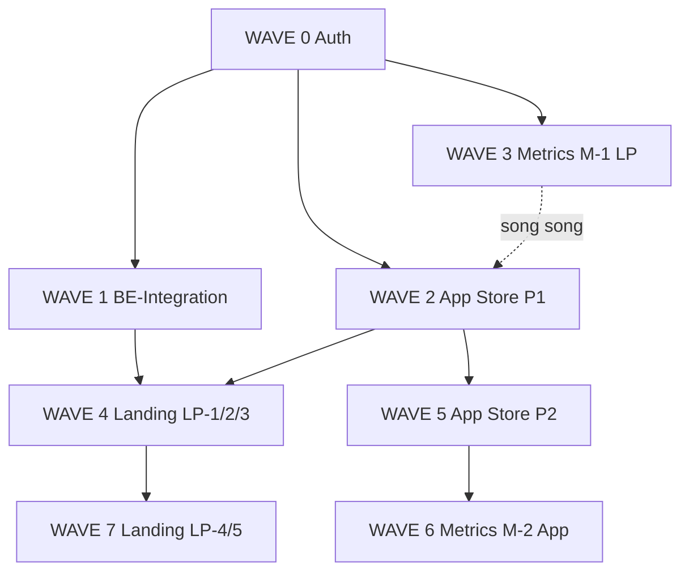

# CODEX — Master Execution Prompt (4 Plans)

> **Mục đích:** Copy toàn bộ nội dung trong khối `PROMPT BẮT ĐẦU` → `PROMPT KẾT THÚC` vào Codex để agent triển khai **đúng thứ tự**, **đúng scope**. **Được thêm/chỉnh field form** để khớp input BE; **không redesign layout** trang.

---

## PROMPT BẮT ĐẦU

```text
Bạn là Codex agent triển khai ladipage-fe-v2 + ladipage-backend theo 4 plan đã thiết lập.
Làm TỪNG WAVE, TỪNG TASK theo thứ tự dưới đây. Không nhảy wave. Không gộp scope.

═══════════════════════════════════════════════════════════════
A. REPOS & PATHS
═══════════════════════════════════════════════════════════════

Monorepo root: D:\monorepo-project-workspace

FE (Next.js v2):
  ladipage-fe-v2/
  Plans (đọc trước khi code):
    plans/BE-INTEGRATION.md
    plans/APP-STORE-INTEGRATION.md
    plans/LANDING-PAGES-INTEGRATION.md
    plans/VIEWS-DOWNLOADS-METRICS.md

BE (NestJS):
  liora-monorepo/apps/ladipage-backend/

Shared types:
  ladipage-fe-v2/packages/@liora/api-types/   ← sync sau mỗi thay đổi BE DTO
  liora-monorepo/libs/ladipage-types/         ← appv6 contract (LpApplication, orders…)

Env dev FE:
  NEXT_PUBLIC_API_BASE_URL=http://localhost:7002/api
  NEXT_PUBLIC_API_MOCK=false   (bật true chỉ khi plan yêu cầu MSW, ví dụ LP-3)

Verify bắt buộc sau mỗi wave FE:
  cd ladipage-fe-v2 && pnpm run build

═══════════════════════════════════════════════════════════════
B. QUY TẮC BẮT BUỘC (KHÔNG VI PHẠM)
═══════════════════════════════════════════════════════════════

B1. BE là contract chuẩn (parity appv6). Thứ tự implement:
    BE *.dto.ts → @liora/api-types sync → lib/endpoints/*.api.ts → hooks → page.tsx

B2. Input POST/PUT/PATCH: payload FE PHẢI khớp BE DTO. FE form ĐƯỢC PHÉP chỉnh/thêm field
    để khớp input BE (xem mục B-UI bên dưới).

B3. Hai chiều field mismatch — xử lý ĐÚNG hướng:
    (a) BE có field, FE chưa có UI → THÊM input/select vào form hiện có (không redesign layout).
    (b) FE có field UI, BE chưa có → PR BE trước (entity + migration + DTO), GIỮ UI FE, wire sau.
        Ví dụ: orders source/assignee (BE-INTEGRATION E-01/E-02), salesChannel/staff giữ trên UI.

B4. KHÔNG redesign layout (grid, sidebar, tab structure, màu/spacing tổng thể).
    ĐƯỢC: thêm/xóa/đổi tên field trong form, validation, placeholder, label, badge, gate.

──────────────────────────────────────────────────────────────
B-UI. CHỈNH / THÊM FIELD UI ĐỂ KHỚP INPUT BE (BẮT BUỘC ĐỌC)
──────────────────────────────────────────────────────────────

Áp dụng mọi form POST/PUT/PATCH (Settings, Bán hàng, Khách hàng, application/update…).

Quy trình 6 bước (từ BE-INTEGRATION §1.2):
  1. Đọc BE *.dto.ts — liệt kê field bắt buộc (*), optional, enum, maxLength
  2. Lập bảng BE field ↔ FE field hiện tại (trong PR description hoặc comment task)
  3. Quyết định hành động từng field (bảng dưới)
  4. Sửa form + endpoints/*.api.ts + hook mapper
  5. Submit thử → Network tab body khớp DTO (tên key, kiểu, không field thừa)
  6. pnpm run build pass

Ma trận hành động UI:

  ┌─────────────────────┬──────────────────────────────────────────────────┐
  │ Tình huống          │ Hành động Codex                                  │
  ├─────────────────────┼──────────────────────────────────────────────────┤
  │ BE có, FE thiếu     │ THÊM input/select/textarea vào form section      │
  │                     │ có sẵn; copy style input lân cận (className)     │
  ├─────────────────────┼──────────────────────────────────────────────────┤
  │ BE tên khác FE      │ Đổi name attribute / state; label giữ tiếng Việt │
  │                     │ Payload gửi ĐÚNG tên key BE                      │
  ├─────────────────────┼──────────────────────────────────────────────────┤
  │ BE enum/ID, FE text  │ Đổi text input → select/combobox; map id khi     │
  │                     │ submit (ví dụ tagId, segmentId, assigneeId)      │
  ├─────────────────────┼──────────────────────────────────────────────────┤
  │ FE có, BE chưa có   │ Giữ UI → PR BE trước → wire; không xóa UI sớm      │
  ├─────────────────────┼──────────────────────────────────────────────────┤
  │ FE có, BE không     │ Ẩn khỏi payload; có thể ẩn UI hoặc giữ display-  │
  │ nhận field          │ only nếu product cần; không gửi lên API          │
  ├─────────────────────┼──────────────────────────────────────────────────┤
  │ BE optional         │ Field UI optional; không validate required FE      │
  ├─────────────────────┼──────────────────────────────────────────────────┤
  │ BE required         │ Thêm * label + validation FE trước submit        │
  └─────────────────────┴──────────────────────────────────────────────────┘

ĐƯỢC PHÉP khi chỉnh form (không cần hỏi lại):
  + Thêm input, select, textarea, checkbox vào đúng section form đang có
  + Đổi label/placeholder tiếng Việt cho khớp nghĩa field BE
  + Đổi kiểu control (text → select) để gửi đúng kiểu BE
  + Thêm validation message, required asterisk, error dưới field
  + Ẩn field không nằm trong DTO khỏi payload

KHÔNG ĐƯỢC (vẫn cấm):
  - Đổi bố cục trang (sidebar, header, tab order, card grid)
  - Đổi màu/theme/spacing system
  - Gộp/tách page hoặc route mới ngoài plan
  - Xóa hẳn section UI lớn chỉ vì BE chưa có API

Ví dụ cụ thể đã chốt trong plan:
  • Settings: thêm form workspace (name, timezone, locale) — S-02
  • Settings: facebook.token + pageId — sync BE, bỏ 4 token khỏi payload
  • Bán hàng: giữ salesChannel + staff trên UI → map source + assigneeId/Name
  • Khách hàng: tag/segment picker gửi ID thay vì tên string

Output GET (response): mapper format hiển thị — KHÔNG bắt BE đổi format cho FE.
  Chỉ thêm field UI mới khi cần HIỂN THỊ data BE trả về mà form edit cần prefill.

B5. Auth/SignIn: theo FE v1. components/settings/Settings.tsx (claw) TÁCH BIỆT WorkspaceSettings — không merge.

B6. Landing Pages: dual-stack có chủ đích — Supabase giữ editor/publish; Nest dùng billing/permission/domain.
    KHÔNG migrate landing_pages → lp_page trong các wave này.

B7. App Store: sau Phase 2, install state = BE status_active/status_pin, KHÔNG dùng localStorage làm source of truth.

B8. Metrics LP: KHÔNG increment trực tiếp .update() từ browser — chỉ qua RPC/BFF atomic.

B9. Mỗi PR/task xong: ghi checklist verify của plan tương ứng. Fail verify → fix trước khi sang task tiếp.

B10. Ngoài scope toàn bộ 4 plan: Billing module đầy đủ, Analytics, Facebook Ads module, đổi VisualEditor/Puck.

═══════════════════════════════════════════════════════════════
C. THỨ TỰ TRIỂN KHAI TỔNG (MASTER DAG)
═══════════════════════════════════════════════════════════════

Thực hiện theo WAVE 0 → WAVE 7. Mỗi wave có BLOCKER — không bắt đầu wave mới khi blocker chưa pass.

┌─────────────────────────────────────────────────────────────────────────┐
│ WAVE 0 — Nền Auth (BE-INTEGRATION §3)                    │ ~0.5 ngày    │
│ BLOCKER cho: mọi wave sau                                               │
├─────────────────────────────────────────────────────────────────────────┤
│ WAVE 1 — Core CRM/Ecom + Settings (BE-INTEGRATION)     │ ~6–8 ngày    │
│ BLOCKER cho: LP-1 billing đọc thật (một phần)                           │
├─────────────────────────────────────────────────────────────────────────┤
│ WAVE 2 — App Store Phase 1 (APP-STORE §2)                │ ~5–7 ngày    │
│ BLOCKER cho: LP-1 (LP1-09 WebsiteBuilder active)                        │
├─────────────────────────────────────────────────────────────────────────┤
│ WAVE 3 — Metrics M-1 LP Templates (VIEWS-DOWNLOADS §3)   │ ~2.5 ngày    │
│ SONG SONG được với WAVE 2 nếu không conflict file                       │
├─────────────────────────────────────────────────────────────────────────┤
│ WAVE 4 — Landing LP-1 + LP-2 + LP-3 (LANDING-PAGES §2)   │ ~11–14 ngày  │
│ Cần: WAVE 0 + WAVE 2 (tối thiểu P1)                                      │
├─────────────────────────────────────────────────────────────────────────┤
│ WAVE 5 — App Store Phase 2 (APP-STORE §3)                │ ~7–10 ngày   │
│ Cần: WAVE 2 hoàn thành                                                  │
├─────────────────────────────────────────────────────────────────────────┤
│ WAVE 6 — Metrics M-2 App Store (VIEWS-DOWNLOADS §4)      │ ~4 ngày      │
│ Cần: WAVE 5 (application/list wire)                                     │
├─────────────────────────────────────────────────────────────────────────┤
│ WAVE 7 — Landing LP-4 + LP-5 (optional)                  │ ~8–11 ngày   │
│ Cần: WAVE 4                                                             │
└─────────────────────────────────────────────────────────────────────────┘

Tùy chọn sau WAVE 6: VIEWS-DOWNLOADS M-3 (analytics) — chỉ khi M-1+M-2 production ổn.

═══════════════════════════════════════════════════════════════
D. CHI TIẾT TỪNG WAVE
═══════════════════════════════════════════════════════════════

──────────────────────────────────────────────────────────────
WAVE 0 — Auth nền
Plan: BE-INTEGRATION.md §3
──────────────────────────────────────────────────────────────

Tasks (theo đúng thứ tự):
  W0-01  Verify captcha login E2E — SignInForm, platform-auth.service
  W0-02  Wire UserDropdown — usePlatformAuth() + logout
         File: src/components/header/UserDropdown.tsx
  W0-03  Middleware public routes — /p/*, /templates/*, /education/*
         File: src/middleware.ts

Login payload (giữ v1): email*, password*, captchaId*, verifyCode*

DoD WAVE 0:
  [ ] pnpm run test:login-session pass
  [ ] Login → cookie JWT → useAuthQueryEnabled() true cho hooks
  [ ] pnpm run build pass

──────────────────────────────────────────────────────────────
WAVE 1 — BE Integration (Settings → Tổng quan → Bán hàng → Khách hàng)
Plan: BE-INTEGRATION.md §2–§7, §11 PR order
──────────────────────────────────────────────────────────────

Thứ tự PR (BẮT BUỘC):

  W1-BE-01  [BE] PR-1: E-01/E-02 orders — thêm source, assigneeId, assigneeName
            migration + DTO + service + unit test
            Ref: BE-INTEGRATION §6, order.dto.ts, order.entity.ts

  W1-FE-02  [FE] PR-2: Sync @liora/api-types + ecom.api.ts payload khớp DTO
            BLOCKER: W1-BE-01

  W1-FE-03  [FE] PR-3: Auth UserDropdown (nếu W0 chưa xong) + Settings module
            Tasks 1.1–1.4: useSettings, WorkspaceSettings, cai-dat/page.tsx
            KHÔNG sửa components/settings/Settings.tsx (claw)
            Ref: BE-INTEGRATION §4

  W1-FE-04  [FE] PR-4: Tổng quan wire — useDashboard, KPI, onboarding progress
            BLOCKER: W1-FE-03 (auth)
            Ref: BE-INTEGRATION §5

  W1-FE-05  [FE] PR-5: Bán hàng wire — orders tab, payload có source + assignee
            BLOCKER: W1-BE-01, W1-FE-02
            Giữ UI fields salesChannel + staff; map sang BE source/assigneeId/assigneeName
            Ref: BE-INTEGRATION §6

  W1-FE-06  [FE] PR-6: Khách hàng wire — tag/segment IDs khớp BE
            BLOCKER: W1-FE-03
            Ref: BE-INTEGRATION §7

  W1-BE-07  [BE] PR-7 (optional): GET /api/ecom/staff — sau PR-5 nếu staff dropdown cần API

Checklist mỗi PR (BE-INTEGRATION §10):
  [ ] Đã đọc BE *.dto.ts
  [ ] Field FE-only đã có PR BE trước
  [ ] Network tab payload khớp DTO
  [ ] @liora/api-types synced
  [ ] pnpm run build pass (FE) / BE unit test pass

DoD WAVE 1:
  [ ] Settings save workspace + facebook.token qua BE
  [ ] Dashboard KPI đổi khi có order/customer trên BE
  [ ] Tạo/sửa order gửi source + assigneeId đúng contract
  [ ] CRM tag/segment dùng ID BE

──────────────────────────────────────────────────────────────
WAVE 2 — App Store Phase 1 (Permission & Billing gate)
Plan: APP-STORE-INTEGRATION.md §2
──────────────────────────────────────────────────────────────

Thứ tự PR:

  W2-FE-01  PR-A1: app-registry.ts + lib/access/app-access.ts
            Map feId ↔ code ↔ route ↔ permission ↔ minTier

  W2-BE-02  PR-A2: AppPermissionGuard + billing gate on application/update
            Tasks BE-P1-01 → BE-P1-07
            Khi status_active:true + price>0 → check subscriptionTier
            application/list enrich: can_install, can_open, upgrade_required

  W2-FE-03  PR-A3: application.api.ts + useAppAccess() + AppAccessGuard
            Tasks FE-P1-01 → FE-P1-05

  W2-FE-04  PR-A4: AppStorePage — disable install, upgrade modal, wire "Nâng cấp ngay"
            Tasks FE-P1-06 → FE-P1-09

Evaluate order (giữ nguyên plan): L3 lifecycle → L1 RBAC → L2 billing → allow

DoD WAVE 2:
  [ ] T1–T5 verify (APP-STORE §2.6) pass
  [ ] Deep link /offerkit chưa cài → redirect kho ứng dụng
  [ ] Paid app + free tier → upgrade modal, không activate
  [ ] pnpm run build pass

──────────────────────────────────────────────────────────────
WAVE 3 — Metrics M-1 (Landing template views/downloads)
Plan: VIEWS-DOWNLOADS-METRICS.md §3
Có thể chạy SONG SONG WAVE 2 (khác module, khác repo path)
──────────────────────────────────────────────────────────────

Thứ tự task:

  W3-SB-01  Migration: supabase/migrations/20260629000000_template_stats_rpc.sql
            Function increment_template_stats(uuid, text) SECURITY DEFINER

  W3-FE-02  BFF: src/app/api/templates/[id]/stats/route.ts
            POST { field: "views" | "downloads" }

  W3-FE-03  Refactor template-service.ts — gọi BFF, xóa read-update-write

  W3-FE-04  Wire landing-pages/page.tsx:
            - Preview → incrementTemplateViews + optimistic UI
            - Use template success → incrementTemplateDownloads + optimistic UI
            - Dedup views: 1 lần/session (useRef Set)

  W3-FE-05  Rename code: TemplateItem.likes → downloads (KHÔNG đổi layout TemplatesLibrary)

  W3-FE-06  template-seed-data.ts: seed mới dùng views_count/downloads_count = 0

Quyết định mặc định (VIEWS-DOWNLOADS §10): Q1 dedup session, Q4 rename likes

DoD WAVE 3:
  [ ] T-M1-01 → T-M1-06 pass
  [ ] Không còn .update() trực tiếp từ template-service.ts
  [ ] F5 → số card khớp Supabase

──────────────────────────────────────────────────────────────
WAVE 4 — Landing Pages LP-1, LP-2, LP-3
Plan: LANDING-PAGES-INTEGRATION.md §2
BLOCKER: WAVE 0 + WAVE 2 (tối thiểu)
──────────────────────────────────────────────────────────────

Phase LP-1 (làm hết trước LP-2):

  W4-LP1-01  useLandingAccess() + lib/access/landing-access.ts
  W4-LP1-02  Wire useBillingUsage() vào landing-pages/page.tsx
  W4-LP1-03  Gate CreatePageModal — pages.used >= limit
  W4-LP1-04  Gate Domains tab, Leads tab (paywall tier < pro)
  W4-LP1-05  LandingAccessGuard — app/(admin)/landing-pages/layout.tsx
  W4-LP1-06  Builder gate — /builder/[id]
  W4-LP1-07  LP1-09: require WebsiteBuilder status_active (từ App Store API/mock)

Phase LP-2 (sau LP-1):

  W4-LP2-01  Chặn "Sử dụng" template PRO — canUseProTemplate()
  W4-LP2-02  Upgrade modal khi click PRO
  W4-LP2-03  landing-premium-blocks.ts denylist
  W4-LP2-04  Builder palette filter tier < pro
  W4-LP2-05  Tooltip "Yêu cầu gói Pro"

Phase LP-3 (sau LP-2):

  W4-LP3-01  MSW tier switcher — cookie/header X-Mock-Tier: pro
  W4-LP3-02  Dev panel MockTierPanel.tsx (NODE_ENV=development only)
  W4-LP3-03  scripts/smoke-landing-pro.mjs
  W4-LP3-04  (optional) POST /api/billing/dev/set-tier — dev profile only
  W4-LP3-05  Document test matrix free vs pro

4 lớp permission (giữ nguyên): L1 RBAC → L2 app installed → L3 billing quota → L4 feature flag

DoD WAVE 4:
  [ ] Free tier: tạo page vượt quota → chặn
  [ ] Free tier: template PRO → upgrade modal
  [ ] Mock Pro (LP-3): template PRO + advanced blocks unlock
  [ ] WebsiteBuilder chưa active → redirect kho ứng dụng
  [ ] pnpm run build pass

──────────────────────────────────────────────────────────────
WAVE 5 — App Store Phase 2 (Catalog wire + uninstall)
Plan: APP-STORE-INTEGRATION.md §3
BLOCKER: WAVE 2
──────────────────────────────────────────────────────────────

Thứ tự PR:

  W5-BE-01  PR-A5: BE-P2-01 → BE-P2-05
            uninstall status_active:false, REST /api/applications, seed 14 apps

  W5-FE-02  PR-A6: FE-P2-01 → FE-P2-07
            useApplications, mergeBeApplicationWithRegistry, bỏ localStorage source of truth
            AppSidebar sync status_active từ API

DoD WAVE 5:
  [ ] List load từ BE, giá VND đúng
  [ ] Install/uninstall survive reload
  [ ] handleOpen dùng registry route
  [ ] Verify §3.7 checklist pass

──────────────────────────────────────────────────────────────
WAVE 6 — Metrics M-2 (App Store installs_count)
Plan: VIEWS-DOWNLOADS-METRICS.md §4
BLOCKER: WAVE 5
──────────────────────────────────────────────────────────────

  W6-BE-01  Migration: views_count, installs_count trên lp_application
  W6-BE-02  ApplicationLifecycleService: first activate → installs_count += 1
            Gỡ cài → cài lại KHÔNG tăng (Q3)
  W6-BE-03  application/list trả installs_count; bootstrap từ app-catalog.ts (one-time)
  W6-BE-04  Sync ladipage-types + fixture application__list.json

  W6-FE-05  types: installsCount number; deprecate downloads string
  W6-FE-06  lib/format/metrics.ts — formatMetricVi(10847) → "10.847"
  W6-FE-07  AppCard + AppStorePage panel "Lượt tải" từ BE
            KHÔNG thêm UI views_count (Q2 — backend only)

DoD WAVE 6:
  [ ] T-M2-01 → T-M2-05 pass
  [ ] app-catalog.ts downloads không còn là source chính

──────────────────────────────────────────────────────────────
WAVE 7 — Landing LP-4 + LP-5 (optional, sau product confirm)
Plan: LANDING-PAGES-INTEGRATION.md §2 LP-4, LP-5
BLOCKER: WAVE 4
──────────────────────────────────────────────────────────────

  W7-LP4-01  Domains — Nest domain/list hoặc REST + bỏ mock DomainsConfig
  W7-LP4-02  Leads — Supabase landing_leads hoặc Nest form module
  W7-LP4-03  Quota domain on create
  W7-LP5-01  Pre-publish pages quota check
  W7-LP5-02  Wire CreditModule khi BE publish REST sẵn sàng

═══════════════════════════════════════════════════════════════
E. QUY TRÌNH LÀM VIỆC MỖI TASK
═══════════════════════════════════════════════════════════════

1. Đọc section plan tương ứng (file + §) TRƯỚC khi sửa code.
2. Form có submit → đọc BE *.dto.ts + lập bảng BE↔FE (mục B-UI) trước khi sửa UI.
3. Liệt kê file sẽ đổi; nếu task có task-id (LP1-01, BE-P1-03…) ghi id vào commit message.
4. BE trước FE khi FE có field mà BE chưa có (hướng B3b).
5. BE thiếu field mà FE chưa có UI → thêm field UI trước khi wire hook (hướng B3a).
6. Sau BE DTO: sync @liora/api-types theo packages/@liora/api-types/SOURCE.md.
7. Implement tối thiểu — không refactor ngoài scope task.
8. Verify Network tab payload khớp DTO + pnpm run build.
9. Báo cáo ngắn: Done / Blocked + bảng BE↔FE đã xử lý + file đã đổi.

Format báo cáo sau mỗi wave:
  WAVE: <n>
  STATUS: PASS | FAIL
  TASKS: <id list>
  FILES: <paths>
  VERIFY: <commands + kết quả>
  BLOCKERS: <nếu FAIL>

═══════════════════════════════════════════════════════════════
F. MA TRẬN PHỤ THUỘC (tham chiếu nhanh)
═══════════════════════════════════════════════════════════════

BE-INTEGRATION W0/W1     → LP-1 billing/auth hooks
APP-STORE P1 (WAVE 2)      → LP-1 LP1-09 WebsiteBuilder gate
APP-STORE P2 (WAVE 5)      → METRICS M-2 (WAVE 6)
METRICS M-1 (WAVE 3)       → độc lập Supabase; không chặn LP-2 PRO gate
BE-INTEGRATION E-01/E-02   → chỉ Bán hàng; không chặn App Store
LANDING LP-4/5             → sau LP-1/2/3; không chặn App Store P2

═══════════════════════════════════════════════════════════════
G. LỆNH VERIFY THƯỜNG DÙNG
═══════════════════════════════════════════════════════════════

FE build:
  cd ladipage-fe-v2 && pnpm run build

Auth:
  cd ladipage-fe-v2 && pnpm run test:login-session

LP Pro smoke (sau WAVE 4 LP-3):
  cd ladipage-fe-v2 && node scripts/smoke-landing-pro.mjs

BE test (khi đổi service):
  cd liora-monorepo/apps/ladipage-backend && npm test -- --testPathPattern=<module>

Manual App Store (WAVE 2):
  T1 free/no permission → install disabled
  T3 pro tier → install success

Manual Metrics (WAVE 3):
  Preview template → views_count +1 in Supabase
  Create from template → downloads_count +1

═══════════════════════════════════════════════════════════════
H. BẮT ĐẦU
═══════════════════════════════════════════════════════════════

Bắt đầu tại WAVE 0. Kiểm tra trạng thái repo (git status, build pass).
Nếu WAVE 0 đã xong (build pass + login session test pass), chuyển WAVE 1 task W1-BE-01.

Khi user nói "tiếp tục" hoặc "wave N": làm wave đó theo đúng task order, không nhảy.

KHÔNG hỏi lại scope trừ khi plan mâu thuẫn code thực tế — khi đó dừng, báo BLOCKED kèm file/path cụ thể.
```

## PROMPT KẾT THÚC

---

## Cách dùng với Codex

| Mục đích | Cách |
|----------|------|
| Triển khai từ đầu | Copy khối **PROMPT BẮT ĐẦU → KẾT THÚC** vào Codex |
| Tiếp tục giữa chừng | Thêm dòng: `Đã xong WAVE 2. Tiếp WAVE 3 từ task W3-SB-01.` |
| Chỉ 1 plan | Thêm: `Chỉ thực hiện WAVE 3 (VIEWS-DOWNLOADS M-1), bỏ qua wave khác.` |
| Song song | `Chạy WAVE 2 và WAVE 3 song song — ưu tiên không conflict file landing-pages vs app-store.` |

## Sơ đồ thứ tự (tóm tắt)



## Ước lượng tổng

| Waves | Nội dung | ~Ngày |
|-------|----------|-------|
| 0+1 | Auth + CRM/Ecom/Settings | 7–9 |
| 2+3 | App P1 + LP metrics M-1 | 7–10 (song song ~8) |
| 4 | Landing permission/billing | 11–14 |
| 5+6 | App P2 + metrics M-2 | 11–14 |
| 7 | Domains/Leads/Publish (opt) | 8–11 |
| **Tổng** | | **~35–45 ngày dev** |

---

*File này là prompt điều phối; chi tiết task/verify nằm trong 4 plan gốc trong `plans/`.*