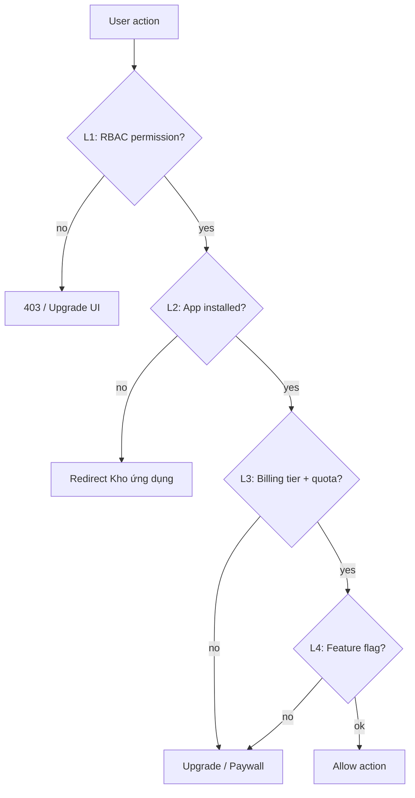

# Kế hoạch đấu nối — Landing Pages

> **Ngày:** 2026-06-29  
> **Phạm vi:** `/landing-pages`, `/builder/[id]`, `/p/[slug]`, thư viện mẫu  
> **Trọng tâm:** Permission + Billing gate + giả lập Pro để test tính năng cao cấp

---

## 0. Hiện trạng (audit)

### Kiến trúc dual-stack

```
┌─────────────────────────────────────────────────────────────┐
│  ladipage-fe-v2 — Landing Pages (ĐANG CHẠY)                 │
│  • Supabase: landing_pages, templates, versions, publish    │
│  • Next BFF: /api/landing-pages, /api/builder/session       │
│  • Editor: VisualEditor (custom blocks, KHÔNG phải Puck)    │
│  • Public: /p/[slug] SSR từ published_html                  │
└─────────────────────────────────────────────────────────────┘
                          ✕ chưa kết nối billing/permission
┌─────────────────────────────────────────────────────────────┐
│  ladipage-backend — Legacy RPC (CÓ, FE KHÔNG DÙNG)          │
│  • POST /ladipage/ladi-page/list|show                        │
│  • POST /ladipage/domain/list                               │
│  • lp_page entity (schema appv6)                            │
│  • PublishController stubs + TODO billing                   │
└─────────────────────────────────────────────────────────────┘
```

### FE — từng submodule

| Tab / Feature | File chính | Data | Permission/Billing |
|---------------|------------|------|-------------------|
| **Pages list** | `landing-pages/page.tsx`, `PagesList` | Supabase ✅ | Chỉ ownership `user_id` |
| **Templates** | `TemplatesLibrary.tsx` | Supabase + seed ✅ | `isPro` badge only — **không chặn** |
| **Builder** | `/builder/[id]`, `VisualEditor` | Supabase + localStorage | Session JWT ✅ |
| **Domains** | `DomainsConfig.tsx` | **Mock in-memory** | UI upgrade 0/0 + nút bypass |
| **Leads** | `DataLeads.tsx` | **mockLeads** | Paywall copy "Core+" — toggle test UI |
| **Forms/Tags** | sub-components | **useState mock** | Không gate |
| **Publish** | `publishLandingPage()` | Supabase ✅ | Không check quota |
| **Create page** | `CreatePageModal.tsx` | Supabase | Không check `pages.limit` |

### Billing hiện có (app-level, chưa wire landing)

```typescript
// mocks/data.ts — tier free, vượt quota
mockBillingUsage: {
  pages: { used: 2, limit: 1 },
  domains: { used: 0, limit: 0 },
  subscriptionTier: "free",
}
```

- `billing.api.ts`: `/billing/usage`, `/billing/subscribe` — **landing không gọi**
- MSW handler serve mock usage khi `NEXT_PUBLIC_API_MOCK=true`

### Permission hiện có

| Nguồn | Dùng ở landing? |
|-------|-----------------|
| `platform.permissions[]` | ❌ |
| `platform.menus[]` | ❌ |
| Supabase page `user_id` | ✅ builder session only |
| Plan tier | ❌ (UI prototype) |

---

## 1. Mô hình phân quyền mục tiêu (4 lớp)



### L1 — RBAC (ai được vào module)

| Permission key | Cho phép |
|----------------|----------|
| `landing:pages:view` | Xem list trang |
| `landing:pages:edit` | Mở builder, sửa |
| `landing:pages:publish` | Publish |
| `landing:templates:view` | Xem thư viện mẫu |
| `landing:templates:use_pro` | Áp dụng template PRO |
| `landing:domains:manage` | Tab tên miền |
| `landing:leads:view` | Tab data leads |
| `landing:builder:advanced` | Blocks cao cấp (funnel, chat widget, …) |

Nguồn: `GET /api/account/permissions` (đã load vào `platform.permissions`).

### L2 — App lifecycle

Landing Pages = app `WebsiteBuilder` trong kho ứng dụng.  
Cần `status_active: true` (xem plan `APP-STORE-INTEGRATION.md`).

### L3 — Billing tier & quota

| Hành động | Min tier | Quota check |
|-----------|----------|-------------|
| Tạo trang mới | free | `pages.used < pages.limit` |
| Publish trang | free |同上 |
| Thêm domain | pro | `domains.used < domains.limit` |
| Xem/export Leads | pro (Core+) | không quota — tier only |
| Dùng template PRO | pro | tier only |
| Blocks advanced trong builder | pro | tier only |

Nguồn: `GET /api/billing/usage` → `BillingUsageDto`.

### L4 — Feature / template flag

| Flag | Nguồn | Gate |
|------|-------|------|
| `price_type: "pro"` | Supabase `landing_page_templates` | L3 + L1 `templates:use_pro` |
| `isPro: true` | seed / mapper |同上 |
| Block type trong denylist | `config/landing-premium-blocks.ts` | L1 `builder:advanced` |

---

## 2. Kế hoạch triển khai

### Phase LP-1 — Permission shell + billing đọc thật (5–6 ngày)

**Mục tiêu:** Mọi tab landing check permission; billing usage đọc từ Nest (hoặc MSW).

| # | Task | File / việc |
|---|------|-------------|
| LP1-01 | `useLandingAccess()` hook | `features/landing-pages/hooks/useLandingAccess.ts` |
| LP1-02 | Permission helpers | `lib/access/landing-access.ts` |
| LP1-03 | Wire `useBillingUsage()` vào hub | `landing-pages/page.tsx` |
| LP1-04 | Gate tạo trang | `CreatePageModal` — chặn khi `pages.used >= limit` |
| LP1-05 | Gate tab Domains | ẩn hoặc paywall khi tier < pro |
| LP1-06 | Gate tab Leads | paywall khi tier < pro |
| LP1-07 | `LandingAccessGuard` layout | `app/(admin)/landing-pages/layout.tsx` |
| LP1-08 | Builder gate | `/builder/[id]` — check `landing:pages:edit` + quota |
| LP1-09 | Đồng bộ với App Store | require `WebsiteBuilder` active |

### Phase LP-2 — Template PRO + Builder premium blocks (4–5 ngày)

| # | Task | Chi tiết |
|---|------|----------|
| LP2-01 | Chặn "Sử dụng" template PRO | `TemplatesLibrary.tsx` → `canUseProTemplate()` |
| LP2-02 | Upgrade modal khi click PRO | reuse `UpgradeModal` / billing subscribe |
| LP2-03 | `landing-premium-blocks.ts` | denylist block types: `funnel_popup`, `chat_widget`, `survey`, … |
| LP2-04 | Builder palette filter | ẩn/khóa block khi tier < pro |
| LP2-05 | Tooltip "Yêu cầu gói Pro" | UX giống appv6 |

### Phase LP-3 — Billing giả lập Pro để test (2–3 ngày)

**Mục tiêu:** Dev/QA bật tier Pro không cần Stripe thật.

| # | Task | Chi tiết |
|---|------|----------|
| LP3-01 | MSW tier switcher | `mocks/handlers.ts` — đọc cookie/header `X-Mock-Tier: pro` |
| LP3-02 | Dev panel "Giả lập gói" | `components/dev/MockTierPanel.tsx` (chỉ `NODE_ENV=development`) |
| LP3-03 | Script smoke | `scripts/smoke-landing-pro.mjs` — assert PRO template blocked/unblocked |
| LP3-04 | Nest dev endpoint (optional) | `POST /api/billing/dev/set-tier` — **chỉ dev profile** |
| LP3-05 | Document test matrix | bảng case free vs pro (cuối file này) |

**Luồng test Pro giả lập:**

```
QA mở Dev Panel → chọn "Pro"
  → MSW trả subscriptionTier: "pro", pages.limit: 50
  → Template PRO → "Sử dụng" enabled
  → Domains tab → mở được (vẫn mock data đến LP-4)
  → Leads tab → mở được
  → Builder advanced blocks → unlock
```

### Phase LP-4 — Domains & Leads đấu nối data (5–7 ngày, sau permission)

| # | Task | Backend |
|---|------|---------|
| LP4-01 | Domains list/create | Nest `domain/list` RPC hoặc REST mới + Supabase sync |
| LP4-02 | Leads | Supabase table `landing_leads` hoặc Nest form module |
| LP4-03 | Bỏ mock + bypass UI | `DomainsConfig`, `DataLeads` |
| LP4-04 | Quota domain trên create | `domains.used < limit` |

### Phase LP-5 — Publish + credit (optional, 3–4 ngày)

| # | Task |
|---|------|
| LP5-01 | Pre-publish check `pages` quota |
| LP5-02 | Wire `CreditModule` khi BE publish REST sẵn sàng |
| LP5-03 | Không deprecate Supabase publish cho đến khi Nest parity |

> **Không** migrate `landing_pages` sang `lp_page` trong phase này — dual-stack có chủ đích; Nest dùng cho **billing/permission/domain**, Supabase giữ **editor/publish**.

---

## 3. Ma trận tính năng × tier (mục tiêu)

| Tính năng | Free | Pro | Enterprise |
|-----------|------|-----|------------|
| Tạo trang (≤ limit) | ✅ | ✅ | ✅ |
| Builder cơ bản | ✅ | ✅ | ✅ |
| Template FREE | ✅ | ✅ | ✅ |
| Template PRO | 🔒 | ✅ | ✅ |
| Blocks advanced | 🔒 | ✅ | ✅ |
| Publish | ✅ (≤ limit) | ✅ | ✅ |
| Custom domain | 🔒 | ✅ (≤ limit) | ✅ |
| Data Leads | 🔒 | ✅ | ✅ |
| Export leads | 🔒 | ✅ | ✅ |
| Form config sync BE | 🔒 | ✅ | ✅ |

---

## 4. Chi tiết gate — Thư viện mẫu (Templates)

### Hiện tại

```typescript
// template-seed-data.ts
price_type: "free" | "pro"
isPro: boolean  // → badge UI only
```

### Mục tiêu

```typescript
function handleUseTemplate(template: TemplateItem) {
  if (template.price_type === "pro" && !canUseProTemplate(access)) {
    openUpgradeModal({ feature: "pro_template", templateId: template.id });
    return;
  }
  applyTemplateToPage(template);
}
```

`canUseProTemplate` = L1 `landing:templates:use_pro` **AND** L3 `tier >= pro`.

---

## 5. Chi tiết gate — Builder

### Blocks đề xuất premium (Pro)

| Block type | Lý do |
|------------|-------|
| `funnel_popup` | Conversion advanced |
| `chat_widget` | Third-party integration |
| `survey` | Data collection |
| `html_code` | Custom script — security |
| `product_card` + `collection_list` | Ecom integration |

### Hành vi khi Free user

- Palette: block hiện với icon 🔒
- Click insert → Upgrade modal
- Trang đã có block PRO từ trước (downgrade tier): **read-only** block, không edit

---

## 6. Tích hợp Billing giả lập — spec kỹ thuật

### Option A — MSW only (khuyến nghị cho FE dev)

```typescript
// mocks/handlers.ts
http.get("/api/billing/usage", ({ request }) => {
  const mockTier = request.headers.get("X-Mock-Tier") ?? "free";
  return HttpResponse.json(resOp(buildUsageForTier(mockTier)));
});
```

Dev panel set `localStorage.setItem("mock-tier", "pro")` → MSW đọc.

### Option B — Nest dev profile

```typescript
// Chỉ khi process.env.NODE_ENV !== 'production'
POST /api/billing/dev/simulate-tier { tier: "pro" }
// Ghi vào org test flag — BillingService.getCurrentBilling trả tier giả
```

### Test matrix (QA)

| # | mock-tier | Action | Expected |
|---|-----------|--------|----------|
| Q1 | free | Tạo trang thứ 3 (limit 1) | Chặn + upgrade |
| Q2 | free | Dùng template PRO | Upgrade modal |
| Q3 | pro | Dùng template PRO | Tạo trang thành công |
| Q4 | pro | Mở tab Leads | Không paywall |
| Q5 | free | Insert block `funnel_popup` | Upgrade modal |
| Q6 | pro | Publish | OK |

---

## 7. PR FE đề xuất

| PR | Nội dung |
|----|----------|
| PR-L1 | `useLandingAccess` + permission helpers |
| PR-L2 | Billing usage wire + create page quota |
| PR-L3 | Template PRO gate + upgrade modal |
| PR-L4 | Builder premium blocks filter |
| PR-L5 | Mock tier panel + MSW + smoke script |
| PR-L6 | Domains/Leads data (phase LP-4) |

---

## 8. Báo cáo kết quả đạt được nếu triển khai

### Sau Phase LP-1 + LP-2 + LP-3 (permission + billing + mock Pro)

| Hạng mục | Trước | Sau |
|----------|-------|-----|
| Template PRO enforcement | 0% (badge only) | 100% chặn + upgrade path |
| Tạo trang vượt quota | Không chặn | Chặn theo `pages.limit` |
| Tab Leads/Domains | UI mock + bypass | Paywall thật theo tier |
| Builder blocks premium | Mở cho all | Gate theo Pro |
| Test Pro without Stripe | Không có | Mock tier panel + MSW |
| Permission RBAC landing | Không | 8 permission keys |

**Kết quả nghiệp vụ:**
- Parity appv6: free user thấy giới hạn rõ, Pro user dùng đủ tính năng cao cấp
- QA test full flow Pro trong 5 phút (không cần thẻ Stripe)
- Giảm rủi ro abuse: không publish unlimited trên free tier
- Nền tảng sẵn sàng gắn Stripe thật (`subscribe` đã có)

### Sau Phase LP-4 + LP-5 (data + publish credit)

| Hạng mục | Kết quả |
|----------|---------|
| Domains | List/create thật + quota domain |
| Leads | Data thật từ form submit, export |
| Publish | Quota + optional credit deduction |
| Dual-stack | Supabase editor + Nest billing/permission — ranh giới rõ |

### Chỉ số đo lường (KPI)

| KPI | Target |
|-----|--------|
| % hành động landing có permission check | 100% (create, publish, template pro, tabs) |
| False positive block (Pro user bị chặn) | 0% trên test matrix Q3–Q6 |
| Thời gian QA toggle free↔pro | < 30 giây (dev panel) |
| Regression builder free templates | 0 break (Q1 free template vẫn dùng được) |

---

## 9. Rủi ro & quyết định cần confirm

| # | Câu hỏi | Đề xuất mặc định |
|---|---------|-------------------|
| 1 | "Producer" = Pro tier hay role riêng? | **Pro tier** + optional `landing:builder:advanced` permission |
| 2 | Migrate Supabase → lp_page? | **Không** trong 2 phase đầu |
| 3 | Leads data store? | Supabase `landing_leads` trước, sync Nest sau |
| 4 | Domain API? | Nest RPC `domain/list` wrap REST |
| 5 | Giữ nút bypass Domains? | **Xóa** sau LP-1 — thay mock tier panel |

---

## 10. Tài liệu tham chiếu

| File | Path |
|------|------|
| Landing hub | `src/app/(admin)/landing-pages/page.tsx` |
| Templates | `src/components/landing-pages/templates/` |
| Domains mock | `src/components/landing-pages/domains/DomainsConfig.tsx` |
| Leads mock | `src/components/landing-pages/leads/DataLeads.tsx` |
| Builder | `src/features/landing-builder/`, `/builder/[id]` |
| Billing API | `src/lib/endpoints/billing.api.ts` |
| MSW mocks | `src/mocks/data.ts`, `handlers.ts` |
| BE ladi-page RPC | `modules/ladipage-rpc/.../page.service.ts` |
| BE domain RPC | `modules/.../domain.service.ts` |
| App Store dep | `plans/APP-STORE-INTEGRATION.md` (WebsiteBuilder active) |

Báo cáo kết quả nếu triển khai
Landing Pages
┌───────────────────────┬────────────────────────────┐
│ KPI                   │ Sau LP-1~3                 │
├───────────────────────┼────────────────────────────┤
│ Template PRO          │ Chặn thật + upgrade path   │
├───────────────────────┼────────────────────────────┤
│ Quota pages           │ Enforce pages.used < limit │
├───────────────────────┼────────────────────────────┤
│ Test Pro không Stripe │ Dev panel toggle < 30s     │
├───────────────────────┼────────────────────────────┤
│ QA matrix             │ 6 case free/pro documented │
└───────────────────────┴────────────────────────────┘