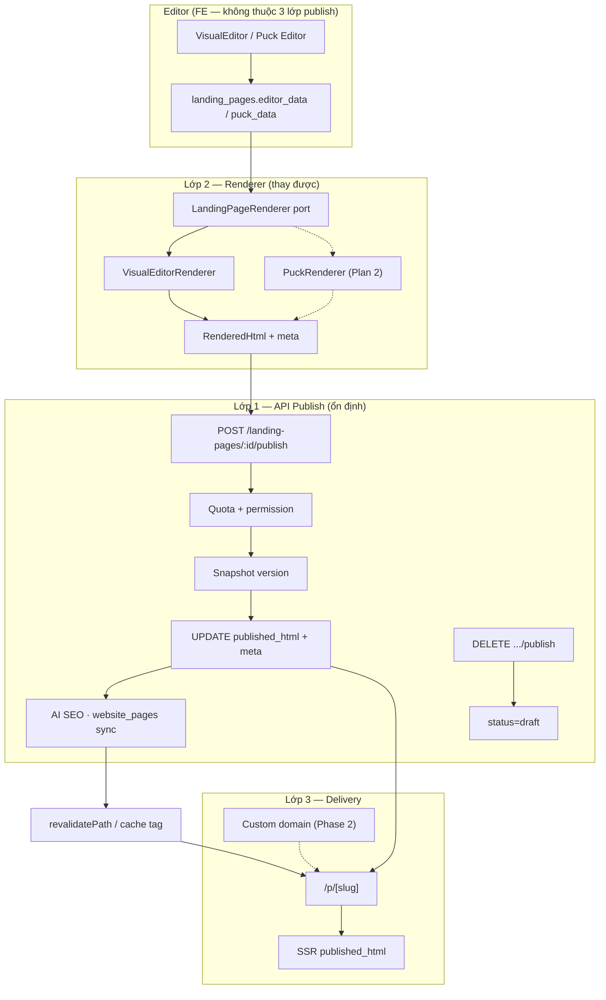
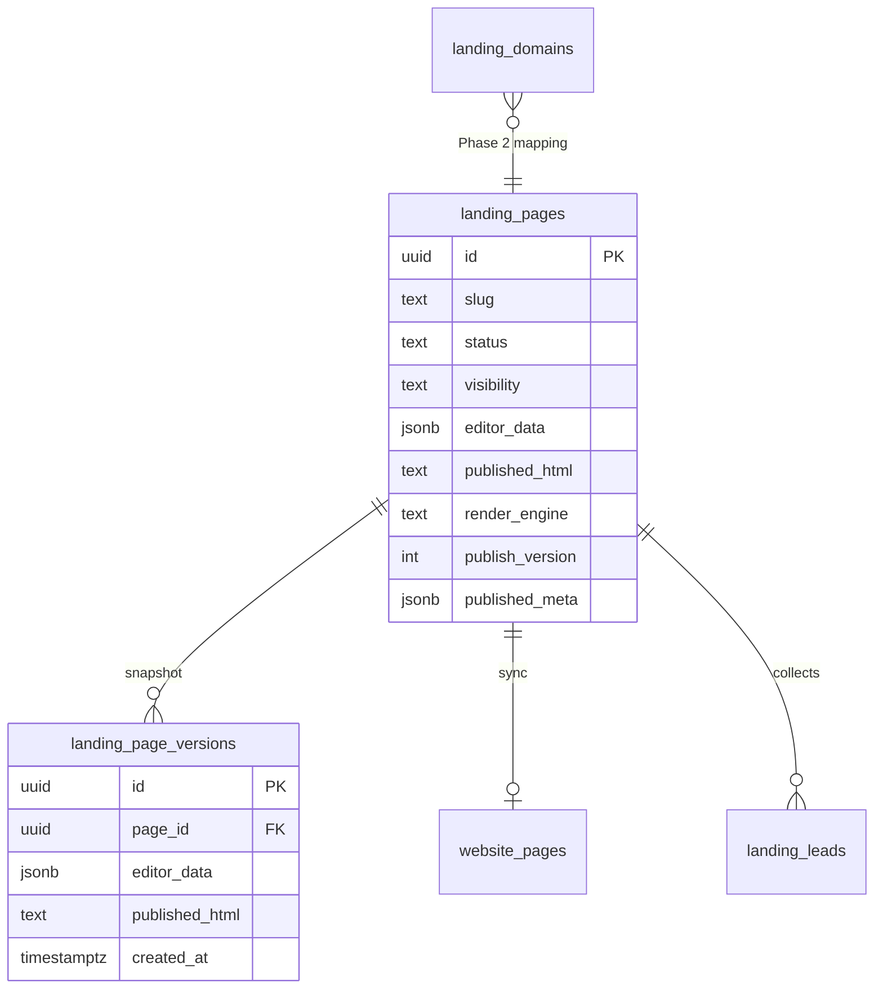
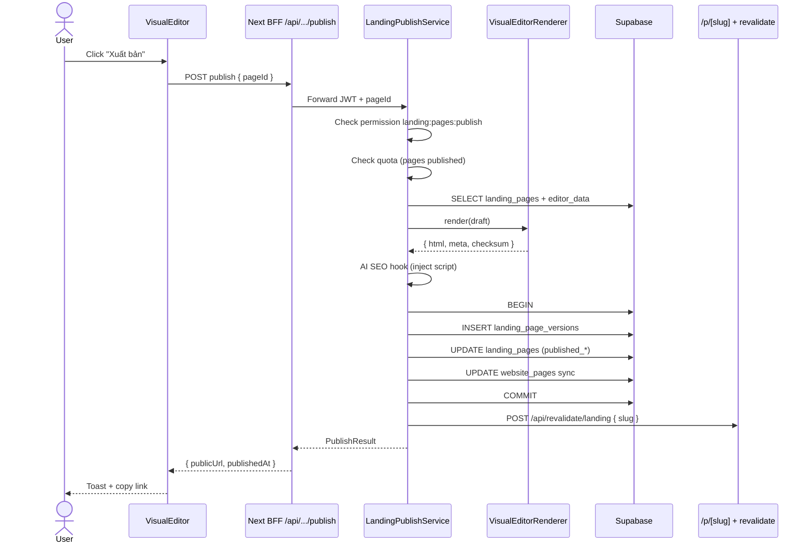
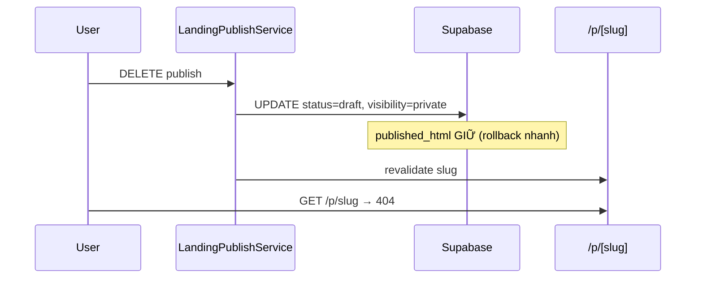
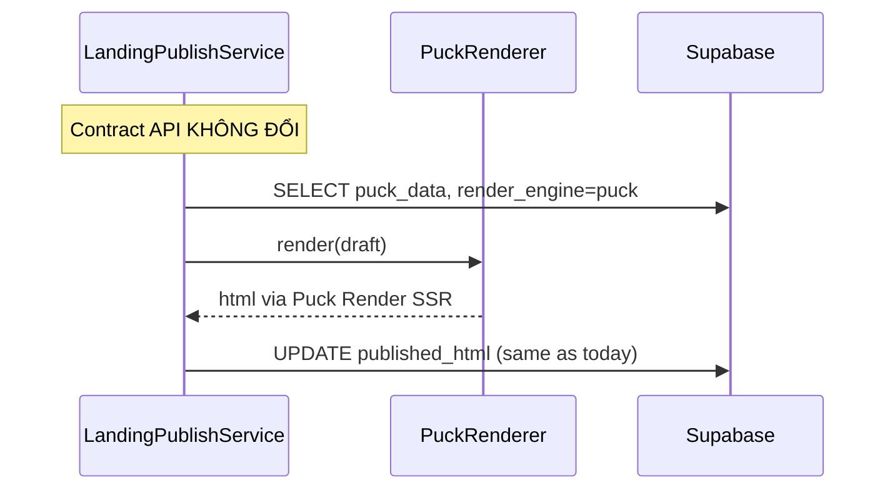
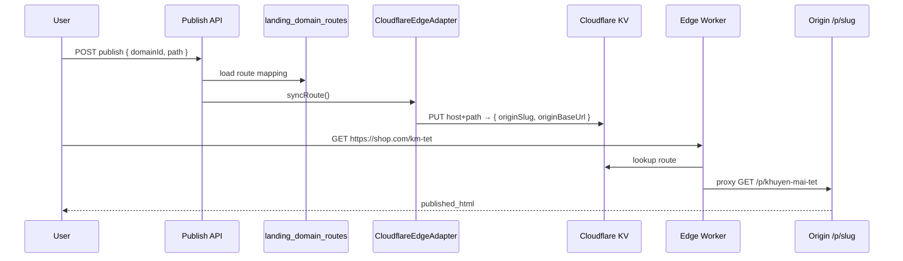
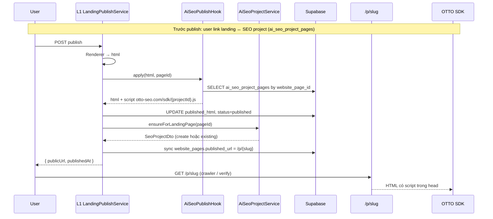
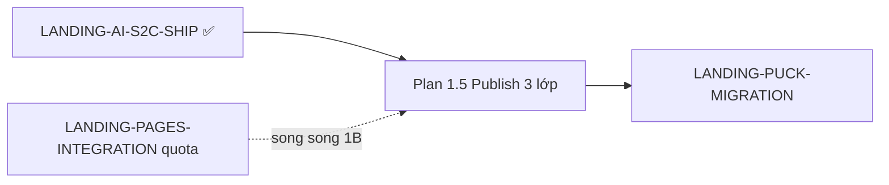

# Plan 1.5 — Publish 3 lớp (Renderer độc lập Puck)

> **Ngày:** 2026-07-09  
> **Phạm vi:** Luồng publish production — tách **API publish · Renderer · Delivery** để migrate Puck sau **không đụng** contract publish  
> **Điều kiện:** [LANDING-AI-S2C-SHIP.md](./LANDING-AI-S2C-SHIP.md) đã ship (editor + AI ổn định)  
> **Tiền đề:** [LANDING-PAGES-INTEGRATION.md](./LANDING-PAGES-INTEGRATION.md) (billing/permission) — có thể song song Phase 1B  
> **Kế tiếp:** [LANDING-PUCK-MIGRATION.md](./LANDING-PUCK-MIGRATION.md) chỉ thay **Lớp 2**; [BE-INTEGRATION.md](./BE-INTEGRATION.md) cho Nest contract

---

## 0. Mục tiêu & phạm vi

### Mục tiêu

- Đưa publish từ **Supabase client-side** lên **Nest API production** (quota, audit, versioning).
- Chuẩn hóa **một contract publish** ổn định — Puck migrate sau chỉ đổi implementation renderer.
- Giữ delivery hiện tại: `/p/[slug]` SSR từ `published_html` (Lớp 3).
- Chuẩn bị custom domain + revalidate (Phase 2) mà không refactor lại API.

### In scope

| Lớp | Nội dung |
|-----|----------|
| **L1 — API Publish** | `POST/DELETE .../publish`, versioning, quota, hooks AI SEO |
| **L2 — Renderer** | `LandingPageRenderer` port — `visual-editor` (hiện tại), sau này `puck` |
| **L3 — Delivery** | `/p/[slug]`, metadata, embed SDK, (Phase 2) domain routing |

### Out of scope (plan khác)

- Migrate Puck editor ([LANDING-PUCK-MIGRATION.md](./LANDING-PUCK-MIGRATION.md))
- Billing module đầy đủ ([LANDING-PAGES-INTEGRATION.md](./LANDING-PAGES-INTEGRATION.md) Phase 2)
- Cloudflare Workers production ([liora-monorepo/docs/landing/publish-landingpage.md](../../liora-monorepo/docs/landing/publish-landingpage.md) — Phase 2)
- Analytics / PostHog deep tracking

### Definition of Done

- [ ] Mọi publish/unpublish đi qua **một** API (Nest hoặc BFF proxy Nest) — không còn `supabase.from().update()` trực tiếp từ editor
- [ ] `LandingPageRenderer` interface + adapter `visual-editor` đăng ký trong DI
- [ ] Mỗi lần publish tạo bản ghi `landing_page_versions` (snapshot)
- [ ] `/p/[slug]` không đổi contract đọc — chỉ enrich metadata từ `page_settings`
- [ ] Feature flag `PUBLISH_API=v2` rollback về BFF cũ (`/api/builder/publish`)
- [ ] Doc contract + sequence diagram trong plan này; Puck plan reference L2 only
- [ ] **AI-SEO:** checklist [§9](#9-ai-seo-compatibility-checklist) pass — script inject + `ensureForLandingPage` + URL crawl được

---

## 1. Hiện trạng (audit)

### Luồng publish hôm nay

```
VisualEditor.tsx
  → renderLandingPageHtml(editor_data)     [L2 — inline trong FE]
  → publishLandingPage(pageId, html)       [L1 — Supabase client]
       ├── inject AI SEO script (client)
       ├── UPDATE landing_pages
       └── sync website_pages.published_url

/p/[slug]/page.tsx
  → SELECT published_html WHERE status=published  [L3 — OK]
  → dangerouslySetInnerHTML
```

### File map hiện tại

| Lớp | File | Vấn đề |
|-----|------|--------|
| L1 | `editor/core/editor-supabase-storage.ts` → `publishLandingPage()` | Client-side, không quota, không version |
| L1 | `app/api/builder/publish/route.ts` | BFF có session — **chưa** billing, chưa Nest |
| L2 | `editor/core/editor-export-html.ts` → `renderLandingPageHtml()` | Gắn cứng VisualEditor |
| L2 | `VisualEditor.tsx` L765 | Editor gọi publish + render trực tiếp |
| L3 | `app/p/[slug]/page.tsx` | Metadata thô (`page.name` only) |
| BE | `ladipage-backend/.../publish/publish.controller.ts` | **Demo stub** |
| BE | `ladipage-backend/.../publish/publish.service.ts` | `startPublish()` fake jobId |

### Gap so với target

```
L1: Không có single source of truth · không versioning · không audit
L2: Không có RendererPort · Puck sẽ duplicate publish logic nếu không tách
L3: Thiếu cache tag / revalidate hook · domain mapping mock
```

---

## 2. Kiến trúc 3 lớp

### 2.1 Sơ đồ tổng thể



### 2.2 Ranh giới trách nhiệm

| Lớp | Trách nhiệm | **Không** làm |
|-----|-------------|---------------|
| **L1 API Publish** | Auth, quota, validate slug/domain, gọi renderer, lưu `published_html`, versioning, unpublish, emit events | Render HTML, serve HTTP public |
| **L2 Renderer** | `draft → HTML` + extract SEO meta từ draft | Ghi DB, check billing |
| **L3 Delivery** | Serve public URL, `generateMetadata`, embed script, CDN/domain | Biết editor format |

### 2.3 Nguyên tắc cốt lõi (Puck-safe)

1. **L1 input/output cố định** — client gửi `pageId` (+ optional `draftOverride`); response `{ slug, publicUrl, publishedAt, versionId }`. Không gửi `puck_data` vs `editor_data` trong contract — server đọc từ DB + `render_engine`.
2. **L2 pluggable** — registry `render_engine → RendererAdapter`.
3. **L3 đọc output L1** — ưu tiên `published_html`; Puck Phase 2 có thể thêm runtime SSR nhưng **fallback** `published_html` luôn tồn tại.
4. **Freeze on publish** — `published_html` là artifact bất biến cho đến lần publish tiếp theo.

---

## 3. Cấu trúc thư mục & module

### 3.1 Monorepo layout

```
liora-monorepo/
  apps/ladipage-backend/src/modules/
    landing-publish/                    ← NEW module (L1)
      landing-publish.module.ts
      landing-publish.controller.ts
      landing-publish.service.ts
      dto/
        publish-landing-page.dto.ts
        unpublish-landing-page.dto.ts
        publish-result.dto.ts
      ports/
        landing-page-renderer.port.ts   ← L2 interface
        landing-page-storage.port.ts
      renderers/
        visual-editor.renderer.ts       ← L2 impl hiện tại
        puck.renderer.ts                ← stub → Plan 2
      services/
        publish-version.service.ts
        publish-quota.service.ts
        publish-revalidate.service.ts   ← gọi Next revalidate webhook
      hooks/
        ai-seo-publish.hook.ts          ← inject script (move từ FE)

ladipage-fe-v2/
  src/
    features/landing-publish/           ← NEW (FE client)
      api/publish.api.ts
      hooks/usePublishLandingPage.ts
      types/publish.types.ts
    app/
      api/landing-pages/[id]/publish/   ← BFF proxy → Nest (hoặc thin orchestration)
        route.ts
      p/[slug]/page.tsx                 ← L3 (giữ, enrich)
      api/revalidate/landing/           ← webhook secret cho L1
        route.ts
```

### 3.2 Interface L2 — `LandingPageRenderer`

```typescript
// landing-page-renderer.port.ts

export type RenderEngine = 'visual-editor' | 'puck'

export interface PageDraftPayload {
  pageId: string
  renderEngine: RenderEngine
  editorData?: unknown      // visual-editor
  puckData?: unknown        // Plan 2
  pageName: string
  pageSettings?: Record<string, unknown>
}

export interface RenderedPageArtifact {
  html: string
  meta: {
    title: string
    description?: string
    ogImage?: string
  }
  checksum: string          // sha256(html) — audit
}

export interface LandingPageRenderer {
  readonly engine: RenderEngine
  canHandle(draft: PageDraftPayload): boolean
  render(draft: PageDraftPayload): Promise<RenderedPageArtifact>
}
```

**Registry:**

```typescript
class RendererRegistry {
  resolve(engine: RenderEngine): LandingPageRenderer
  resolveFromPage(page: { render_engine: string }): LandingPageRenderer
}
```

### 3.3 Contract L1 — API Publish

**`POST /api/landing-pages/:pageId/publish`**

Request (FE → BFF/Nest):

```typescript
{
  draftOverride?: unknown   // optional — autosave chưa flush
  preserveHtml?: boolean    // AI S2C: giữ html_code blob (Plan 1)
}
```

Response:

```typescript
{
  pageId: string
  slug: string
  publicUrl: string         // /p/{slug}
  publishedAt: string       // ISO
  versionId: string         // landing_page_versions.id
  renderEngine: RenderEngine
}
```

**`DELETE /api/landing-pages/:pageId/publish`** (unpublish)

Response: `{ pageId, status: 'draft', visibility: 'private' }`

**Errors:** `403` quota · `402` plan · `409` slug conflict · `422` render failed

---

## 4. Data model

### 4.1 Cột mới (migration Supabase)

```sql
-- 20260709120000_landing_publish_layer.sql

ALTER TABLE landing_pages
  ADD COLUMN IF NOT EXISTS render_engine TEXT NOT NULL DEFAULT 'visual-editor',
  ADD COLUMN IF NOT EXISTS publish_version INTEGER NOT NULL DEFAULT 0,
  ADD COLUMN IF NOT EXISTS page_settings JSONB NOT NULL DEFAULT '{}'::jsonb,
  ADD COLUMN IF NOT EXISTS published_meta JSONB;  -- { title, description, ogImage }

-- landing_page_versions: thêm published snapshot
ALTER TABLE landing_page_versions
  ADD COLUMN IF NOT EXISTS published_html TEXT,
  ADD COLUMN IF NOT EXISTS published_meta JSONB,
  ADD COLUMN IF NOT EXISTS render_engine TEXT;

CREATE INDEX IF NOT EXISTS idx_landing_pages_published_lookup
  ON landing_pages (slug)
  WHERE status = 'published' AND visibility = 'public';
```

### 4.2 Trạng thái page

| Field | Draft | Published |
|-------|-------|-----------|
| `status` | `draft` | `published` |
| `visibility` | `private` | `public` |
| `editor_data` | live draft | unchanged |
| `published_html` | `NULL` hoặc stale | **frozen** |
| `published_at` | `NULL` | timestamp |
| `publish_version` | N | N+1 mỗi publish |
| `render_engine` | `visual-editor` | engine dùng lúc publish |

### 4.3 Quan hệ bảng



---

## 5. Workflow chi tiết

### 5.1 Publish (happy path)



### 5.2 Unpublish



### 5.3 Re-publish (sửa draft → publish lại)

1. User sửa trong editor → autosave `editor_data` (draft).
2. `published_html` **vẫn serve** cho đến khi publish thành công.
3. Publish mới → version N+1 → swap `published_html` atomically.
4. `/p/[slug]` revalidate → visitor thấy bản mới.

### 5.4 AI S2C preserve HTML (Plan 1 compat)

Khi `editor_data` chứa block `html_code` + `generation_meta.preserveHtml`:

```
Renderer: nếu preserveHtml → dùng ai_source_html hoặc html_code trực tiếp
         else → renderLandingPageHtml(editor_data)
```

Logic này nằm trong `VisualEditorRenderer` — L1 không biết chi tiết.

### 5.5 Publish failure & rollback

| Lỗi | Hành vi |
|-----|---------|
| Render throw | 422, DB không đổi, public giữ bản cũ |
| Quota exceeded | 403, không render |
| DB partial write | Transaction rollback |
| Revalidate fail | Publish **vẫn success** — log warning, CDN stale tối đa TTL |

### 5.6 Luồng tương lai — Puck (chỉ L2 đổi)



---

## 6. Phase triển khai

### Tổng quan timeline

| Phase | Thời gian | Deliverable |
|-------|-----------|-------------|
| **1A** — L2 port + extract | 2–3 ngày | Renderer registry, move HTML export |
| **1B** — L1 Nest API | 3–4 ngày | Publish/unpublish production |
| **1C** — FE wire + deprecate client publish | 2 ngày | Editor → BFF only |
| **1D** — L3 hardening | 1–2 ngày | Metadata, revalidate, 404 strict |
| **2** — Domain + CDN | 1 tuần | `landing_domains` → routing |
| **3** — Puck L2 swap | Plan 2 | `PuckRenderer` register |

---

### Phase 1A — Tách L2 Renderer (2–3 ngày)

#### PR-PUB-1: Port + VisualEditor adapter

**BE:** `landing-publish/renderers/visual-editor.renderer.ts`

- Port `renderLandingPageHtml` logic (hoặc gọi shared package).
- `preserveHtml` branch cho AI pages.
- Unit test: fixture `editor_data` → stable HTML checksum.

**Shared (optional):** `libs/landing-render/` nếu cần dùng chung FE+BE — hoặc BE gọi HTTP internal render service (đơn giản hơn: duplicate tạm, dedupe sau).

#### PR-PUB-2: Renderer registry + stub Puck

```typescript
// puck.renderer.ts — Plan 2
export class PuckRenderer implements LandingPageRenderer {
  readonly engine = 'puck' as const
  canHandle() { return false }  // until Plan 2
  async render() { throw new Error('Puck renderer not enabled') }
}
```

---

### Phase 1B — L1 Nest API (3–4 ngày)

#### PR-PUB-3: `LandingPublishModule`

**Files:** controller, service, DTO sync `@liora/api-types`

**`LandingPublishService.publish(pageId, userId, opts)`:**

1. Load page (Supabase service role hoặc TypeORM bridge).
2. `PublishQuotaService.assertCanPublish(userId)`.
3. `RendererRegistry.resolveFromPage(page).render(...)`.
4. `AiSeoPublishHook.apply(html, pageId)`.
5. `PublishVersionService.createSnapshot(...)`.
6. Update `landing_pages` + `website_pages`.
7. `PublishRevalidateService.trigger(slug)`.
8. `PublishService.onLandingPagePublished(pageId)` (AI SEO project — đã có stub).

#### PR-PUB-4: Quota + permission

- Wire `landing:pages:publish` từ [LANDING-PAGES-INTEGRATION.md](./LANDING-PAGES-INTEGRATION.md).
- `LandingPageQuotaService` (đã có trong landing-ai) — reuse port.

#### PR-PUB-5: Migration DB

- Apply `20260709120000_landing_publish_layer.sql`.
- Backfill `render_engine='visual-editor'` cho mọi page hiện có.

---

### Phase 1C — FE wire (2 ngày)

#### PR-PUB-6: BFF route proxy

**`app/api/landing-pages/[id]/publish/route.ts`**

```typescript
// POST → ladipage-backend POST /landing-pages/:id/publish
// DELETE → unpublish
// Builder session OR platform JWT
```

#### PR-PUB-7: Refactor VisualEditor

**Thay:**

```typescript
const html = renderLandingPageHtml(...)
await publishLandingPage(page.id, html)
```

**Bằng:**

```typescript
await publishLandingPageApi(page.id)  // server renders
```

- Giữ `renderLandingPageHtml` cho **preview local only**.
- Deprecate `publishLandingPage()` trong `editor-supabase-storage.ts`.
- Feature flag `NEXT_PUBLIC_PUBLISH_API=v2|legacy`.

#### PR-PUB-8: Deprecate `/api/builder/publish`

- Redirect internal calls → new route.
- Xóa sau 2 tuần dual-run.

---

### Phase 1D — L3 Delivery hardening (1–2 ngày)

#### PR-PUB-9: Public metadata

**`app/p/[slug]/page.tsx`**

- Đọc `published_meta` (title, description, ogImage).
- Fallback `page.name` nếu meta rỗng.

#### PR-PUB-10: Revalidate webhook

**`app/api/revalidate/landing/route.ts`**

```typescript
// Header: x-revalidate-secret
// Body: { slug } → revalidatePath(`/p/${slug}`)
```

Nest `PublishRevalidateService` gọi sau publish/unpublish.

#### PR-PUB-11: Cache headers

```typescript
// published pages: Cache-Control public, s-maxage=60, stale-while-revalidate=300
// draft/unpublished: 404 no-store
```

---

### Phase 2 — Domain + CDN (optional, 1 tuần)

> **Local dev:** dùng `http://localhost:3000/p/{slug}` — **không cần** Cloudflare.  
> **Production optional:** khách add domain riêng → Cloudflare edge proxy về origin.  
> **Subdomain logic:** module riêng sau — hiện chỉ scaffold port + stub adapter.

| Task | Trạng thái | Mô tả |
|------|------------|-------|
| PR-PUB-12 | ✅ scaffold | `landing_domain_routes` migration |
| PR-PUB-13 | ✅ scaffold | L1 publish nhận `domainId` + `path` |
| PR-PUB-14 | 🔲 stub | `CloudflareEdgeAdapter` + `cloudflare/landing-edge-worker.stub.ts` |
| PR-PUB-15 | 🔲 sau | SSL status sync + KV deploy thật |

**Env local (mặc định):**

```env
NEXT_PUBLIC_APP_URL=http://localhost:3000
LANDING_CUSTOM_DOMAIN_EDGE_ENABLED=false
```

**Env production (bật khi đấu nối Cloudflare):**

```env
LANDING_CUSTOM_DOMAIN_EDGE_ENABLED=true
CLOUDFLARE_ACCOUNT_ID=...
CLOUDFLARE_API_TOKEN=...
CLOUDFLARE_LANDING_ROUTES_KV_ID=...
CLOUDFLARE_LANDING_EDGE_WORKER=liora-landing-edge
LANDING_ORIGIN_BASE_URL=https://app.liora.vn
```

**L1 contract (backward compatible):**

```typescript
{
  domainId?: string
  path?: string    // default / or /landing
}
```

**Scaffold code:**

```
src/features/landing-domain-edge/
  ports/custom-domain-delivery.port.ts   ← subdomain adapter implement sau
  services/cloudflare-edge.adapter.ts    ← stub → KV/Workers API
  services/domain-route.service.ts
  services/domain-edge-publish.hook.ts
cloudflare/landing-edge-worker.stub.ts   ← reference Worker fetch handler
```

**Luồng đấu nối sau (Phase 2 full):**



---

## 7. Ranh giới với Puck (Plan 2)

### Không đổi khi migrate Puck

| Thành phần | Giữ nguyên |
|------------|------------|
| `POST /landing-pages/:id/publish` | ✅ |
| `published_html` column | ✅ (cache artifact) |
| `landing_page_versions` | ✅ |
| Quota / permission / AI SEO hook | ✅ |
| `/p/[slug]` đọc `published_html` | ✅ (default path) |

### Chỉ đổi / thêm (Plan 2)

| Thành phần | Thay đổi |
|------------|----------|
| `PuckRenderer.render()` | Implement thật |
| `landing_pages.puck_data` | Draft source |
| `render_engine` | `'puck'` cho pages mới |
| `/p/[slug]` (optional) | Runtime `<Render>` nếu `PUBLISH_DELIVERY=puck-ssr` |

### Dual-read trong L1 (transition)

```typescript
function resolveDraft(page) {
  if (page.render_engine === 'puck' && page.puck_data) {
    return { renderEngine: 'puck', puckData: page.puck_data, ... }
  }
  return { renderEngine: 'visual-editor', editorData: page.editor_data, ... }
}
```

---

## 8. Testing & verify

### Unit

| Test | File |
|------|------|
| VisualEditorRenderer checksum | `visual-editor.renderer.spec.ts` |
| preserveHtml branch | fixture từ Plan 1 AI |
| PublishVersionService snapshot | mock DB |

### Integration

| Scenario | Expected |
|----------|----------|
| Publish draft → GET `/p/slug` | 200 + HTML |
| Unpublish → GET `/p/slug` | 404 |
| Re-publish | version++ , HTML đổi |
| Quota full | 403 |
| Invalid session | 401 |
| `PUBLISH_API=legacy` | old BFF vẫn chạy |

### Smoke script

```bash
# ladipage-fe-v2/scripts/smoke-landing-publish.mjs
# create page → publish → curl /p/slug → unpublish → expect 404
```

---

## 9. AI-SEO compatibility checklist

> **Mục tiêu:** Giai đoạn 1 publish đủ cho AI-SEO trên landing **host Liora** (`/p/slug`) — **không cần** Cloudflare Worker.  
> **Tham chiếu:** [AI-SEO-INTEGRATION.md](./AI-SEO-INTEGRATION.md) Phase 3 (landing link) · `PublishService.onLandingPagePublished()` · `AiSeoProjectService.ensureForLandingPage()`

### 9.1 Hai mode tích hợp AI-SEO

| Mode | Mô tả | Giai đoạn publish | Bắt buộc? |
|------|-------|-------------------|-----------|
| **A — Liora host** | Inject OTTO script vào `published_html` lúc publish; crawler/visitor mở `/p/slug` | **Phase 1** | ✅ MVP AI-SEO |
| **B — Edge / site ngoài** | Cloudflare Worker rewrite meta tại edge; site không qua Liora publish | **Phase 2** | ❌ Optional |

**Quyết định:** Triển khai **Mode A** trong Phase 1B–1C. Mode B không block ship AI-SEO core (scan, tasks, installation verify trên `/p/slug`).

### 9.2 Luồng AI-SEO + Publish (target)



### 9.3 Checklist theo PR (triển khai)

#### Phase 1A — Renderer (không block AI-SEO, nhưng verify preserveHtml)

| # | Task | File / vị trí | Done |
|---|------|---------------|------|
| A1 | AI S2C pages (`preserveHtml`) render đúng — script inject vẫn chèn được `</head>` | `visual-editor.renderer.ts` | [ ] |
| A2 | HTML output có `<head>` hợp lệ (hoặc hook fallback append script) | renderer unit test | [ ] |

#### Phase 1B — L1 Nest (core AI-SEO)

| # | Task | File / vị trí | Done |
|---|------|---------------|------|
| B1 | Tạo `AiSeoPublishHook` — port logic từ `editor-supabase-storage.ts` L348–366 | `landing-publish/hooks/ai-seo-publish.hook.ts` | [ ] |
| B2 | Script URL cố định: `https://api.otto-seo.com/sdk/{aiSeoProjectId}.js` | constant trong hook | [ ] |
| B3 | Chỉ inject khi có row `ai_seo_project_pages.website_page_id = pageId` | query Supabase / repo | [ ] |
| B4 | Idempotent: không duplicate script nếu publish lại | `finalHtml.includes(scriptTag)` | [ ] |
| B5 | Sau publish thành công → `PublishService.onLandingPagePublished(pageId, storeId?)` | `landing-publish.service.ts` step 8 | [ ] |
| B6 | `ensureForLandingPage` tạo project với `hostname` từ page URL / slug | `ai-seo-project.service.ts` (đã có) | [ ] |
| B7 | Sync `website_pages`: `published_url=/p/{slug}`, `status=published`, `sync_status=synced` | storage port | [ ] |
| B8 | Unpublish: **không** xóa link `ai_seo_project_pages`; L3 → 404 | unpublish handler | [ ] |
| B9 | Unit test hook: linked / unlinked / re-publish | `ai-seo-publish.hook.spec.ts` | [ ] |

#### Phase 1C — FE wire

| # | Task | File / vị trí | Done |
|---|------|---------------|------|
| C1 | `VisualEditor` publish qua API mới — bỏ inject script ở client | `VisualEditor.tsx` | [ ] |
| C2 | Xóa duplicate inject trong `publishLandingPage()` client (deprecate) | `editor-supabase-storage.ts` | [ ] |
| C3 | AI-SEO BFF `POST .../website-projects/.../publish` delegate sang L1 hoặc gọi chung hook | `app/api/ai-seo/.../publish/route.ts` | [ ] |
| C4 | Response publish trả `publicUrl` — AI-SEO UI hiển thị link verify | publish DTO | [ ] |

#### Phase 1D — L3 Delivery

| # | Task | File / vị trí | Done |
|---|------|---------------|------|
| D1 | `/p/[slug]` serve `published_html` đã có script (không strip) | `app/p/[slug]/page.tsx` | [ ] |
| D2 | `generateMetadata` đọc `published_meta` (title/description) cho crawl preview | `page.tsx` | [ ] |
| D3 | Published page không `no-store` quá aggressive — crawler đọc được | cache headers PR-PUB-11 | [ ] |

#### Song song — AI-SEO module (plan riêng, không block L1)

| # | Task | Plan | Done |
|---|------|------|------|
| S1 | Link/unlink landing ↔ SEO project | AI-SEO Phase 3 | [ ] |
| S2 | `POST .../installations/check` verify script trên live URL | AI-SEO Phase 6 | [ ] |
| S3 | Scan job dùng `publicUrl` hoặc hostname project | AI-SEO Phase 4 | [ ] |

### 9.4 Acceptance criteria (E2E)

Chạy sau khi Phase 1B + 1C xong (staging):

| # | Scenario | Cách verify | Pass |
|---|----------|-------------|------|
| E1 | Landing **chưa** link AI-SEO → publish | `curl /p/slug` — **không** có `otto-seo.com/sdk` | [ ] |
| E2 | Link landing ↔ SEO project → publish | `curl /p/slug` — có `<script async src="https://api.otto-seo.com/sdk/` | [ ] |
| E3 | Re-publish không duplicate script | View source — đúng **1** script tag | [ ] |
| E4 | Publish lần đầu, chưa có SEO project | DB `lp_seo_project` có row mới (`ensureForLandingPage`) | [ ] |
| E5 | Publish lần 2, project đã tồn tại | Không tạo duplicate project (`landingPageId` unique) | [ ] |
| E6 | `website_pages.published_url` | Giá trị `/p/{slug}` khớp slug thật | [ ] |
| E7 | AI-SEO Installation → Verify | Tab installation POST check → `installed: true` (hoặc pixel state) | [ ] |
| E8 | Unpublish | `/p/slug` → 404; link AI-SEO vẫn trong DB | [ ] |
| E9 | OpenSEO scan (optional staging) | Scan job `success` với URL `https://{app}/p/{slug}` | [ ] |

### 9.5 Smoke script (gợi ý)

```bash
# ladipage-fe-v2/scripts/smoke-landing-publish-ai-seo.mjs
# 1. Tạo landing page
# 2. Link ai_seo_project_pages (hoặc connect qua API)
# 3. POST publish (v2 API)
# 4. curl -s "$PUBLIC_BASE/p/$SLUG" | grep -q 'api.otto-seo.com/sdk/'
# 5. GET Nest ensure project exists for pageId
# 6. DELETE unpublish → curl expect 404
```

### 9.6 Hostname & scan — lưu ý triển khai

| Vấn đề | Hành vi Phase 1 | Ghi chú |
|--------|-----------------|---------|
| SEO `hostname` vs URL `/p/slug` | `ensureForLandingPage` dùng hostname normalize từ page record | Document trong UI: scan dùng URL app cho đến Phase 2 domain |
| User ads dùng custom domain | Chưa có — dùng `/p/slug` | Phase 2 map domain → không đổi hook inject |
| Cloudflare Worker installation | UI có option — **out of scope** Phase 1 | Không block checklist E1–E8 |

### 9.7 Deferred → Phase 2 (không làm trong checklist trên)

- [ ] OTTO meta rewrite tại Cloudflare edge (không sửa `published_html`)
- [ ] Scan / verify qua custom domain `shop.com` thay vì `/p/slug`
- [ ] `published_meta` sync ngược từ OTTO deploy task → L1 re-publish tự động

### 9.8 Sign-off

| Vai trò | Điều kiện sign-off |
|---------|-------------------|
| **Landing** | E1–E6 pass |
| **AI-SEO** | E2, E4, E7 pass (+ E9 khi OpenSEO staging sẵn) |
| **QA** | Smoke script + unpublish E8 |

---

## 10. Rủi ro & giảm thiểu

| Rủi ro | Giảm thiểu |
|--------|-------------|
| Render khác nhau FE preview vs server | Single `VisualEditorRenderer` source; preview gọi cùng hàm |
| Publish đứt giữa chừng | DB transaction |
| Puck migrate phá API | Contract freeze + registry |
| Supabase RLS chặn service role | Dùng `service_role` trong Nest storage port |
| Stale CDN | revalidate webhook + short `s-maxage` |

---

## 11. Checklist phụ thuộc



| Plan | Quan hệ |
|------|---------|
| [LANDING-AI-S2C-SHIP.md](./LANDING-AI-S2C-SHIP.md) | Prerequisite — AI pages + `preserveHtml` |
| [LANDING-PAGES-INTEGRATION.md](./LANDING-PAGES-INTEGRATION.md) | Quota/permission wire vào L1 |
| [LANDING-PUCK-MIGRATION.md](./LANDING-PUCK-MIGRATION.md) | Chỉ thay L2 + optional L3 SSR |
| [BE-INTEGRATION.md](./BE-INTEGRATION.md) | DTO sync, api-types |
| [AI-SEO-INTEGRATION.md](./AI-SEO-INTEGRATION.md) | Hook inject script → L1; checklist triển khai [§9](#9-ai-seo-compatibility-checklist) |

---

## 12. Tóm tắt quyết định kiến trúc

| Câu hỏi | Quyết định |
|---------|------------|
| Client gửi HTML lên publish? | **Không** — server render qua L2 |
| `published_html` bỏ khi có Puck? | **Không** — giữ làm cache/CDN artifact |
| Publish qua Supabase client? | **Deprecate** — chuyển Nest/BFF |
| Puck đụng API publish? | **Không** — chỉ register `PuckRenderer` |
| Unpublish xóa `published_html`? | **Không** — giữ để rollback nhanh |
| Phase 1 đủ AI-SEO? | **Có** (Mode A) — xem [§9](#9-ai-seo-compatibility-checklist) |
| Cloudflare Worker cho AI-SEO? | **Không bắt buộc** Phase 1 — Mode B Phase 2 |

**Thứ tự ship:** 1A → 1B → 1C → 1D → (2 domain) → Plan 2 Puck L2.  
**AI-SEO gate:** Sign-off [§9.8](#98-sign-off) trước khi coi Phase 1 publish hoàn tất cho sản phẩm AI-SEO.