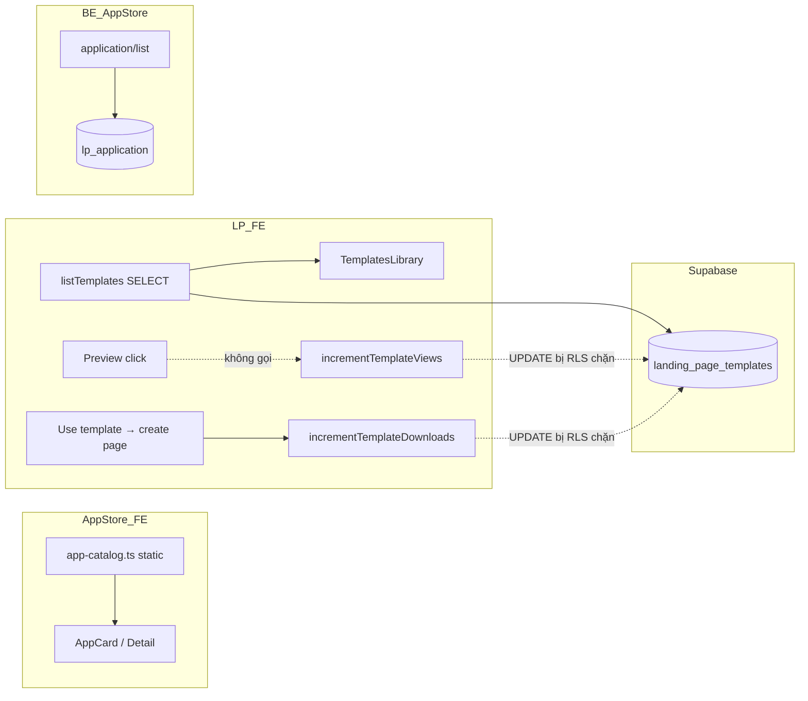
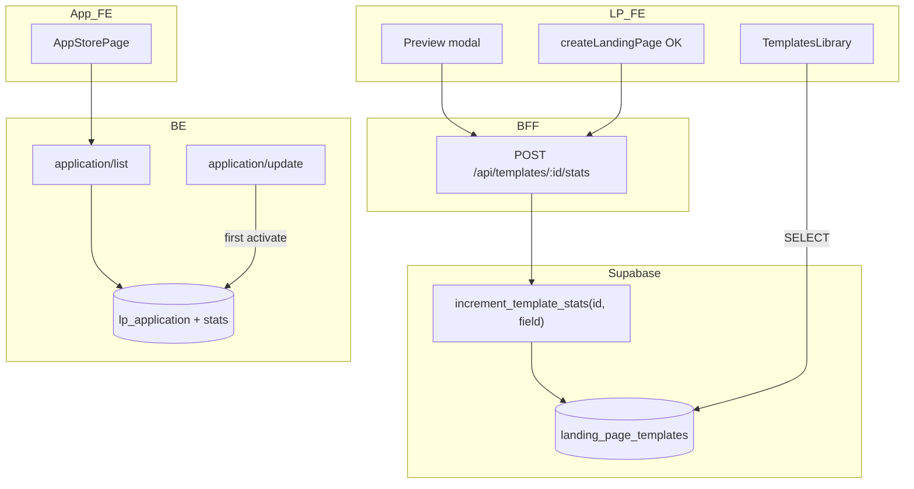
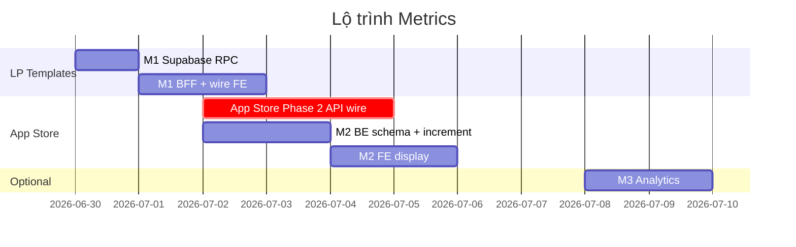

# Kế hoạch triển khai — Metrics `views_count` / `downloads_count`

> **Ngày:** 2026-06-29  
> **Phạm vi:** Kho ứng dụng (`/kho-ung-dung`) + Thư viện mẫu Landing Pages (`/landing-pages` → tab Giao diện mẫu)  
> **Liên quan:** `APP-STORE-INTEGRATION.md` (Phase 2), `LANDING-PAGES-INTEGRATION.md` (LP-2 templates)

---

## 0. Tóm tắt vấn đề

Hai khu vực UI đều hiển thị số liệu **lượt xem / lượt tải (hoặc sử dụng)** nhưng nguồn dữ liệu và độ tin cậy khác nhau hoàn toàn:

| Khu vực | UI hiện tại | Nguồn dữ liệu thực tế | Cập nhật khi user thao tác? |
|---------|-------------|----------------------|----------------------------|
| **Kho ứng dụng** | `downloads` trên card + panel "Lượt tải" | Chuỗi tĩnh trong `app-catalog.ts` | **Không** |
| **Thư viện mẫu LP** | `views` (mắt) + `likes` (icon tải) | Supabase `landing_page_templates` | **Một phần** — chỉ `downloads` khi tạo page; `views` không tăng |

**Mục tiêu:** Số trên UI phản ánh hành vi thật (xem trước, cài app, dùng template), có thể audit, không bị RLS/race condition làm sai lệch.

---

## 1. Hiện trạng (audit chi tiết)

### 1.1 Kho ứng dụng — FE v2

| Thành phần | Path | Ghi chú |
|------------|------|---------|
| Catalog | `features/app-store/data/app-catalog.ts` | 14 app, mỗi app có `downloads: "10.847"` (string format VN) |
| Types | `features/app-store/types.ts` | `downloads?: string` — không có `views_count` |
| Card | `features/app-store/components/AppCard.tsx` | Hiện badge download nếu có |
| Detail | `features/app-store/AppStorePage.tsx` | Panel "Lượt tải" = `selectedApp.downloads ?? "Đang cập nhật"` |
| Install | `storage/app-installation.ts` | localStorage — **không ghi metrics** |

**Không có `views_count` trên UI App Store** — chỉ `downloads` (thực chất là "lượt cài / tải" marketing).

### 1.2 Kho ứng dụng — BE (`ladipage-backend`)

| Thành phần | Trạng thái |
|------------|------------|
| Entity `lp_application` | Có `code`, `price`, `status_active`, `status_pin` — **không có** `views_count` / `downloads_count` |
| `LpApplication` (ladipage-types) | Contract appv6 `POST /2.0/application/list` — **không có** metrics |
| `application/list` | Trả catalog + lifecycle per store |
| `application/update` | Patch `status_active`, `status_pin` — **không increment counter** |

### 1.3 Thư viện mẫu — FE v2

| Thành phần | Path | Ghi chú |
|------------|------|---------|
| Load list | `landing-pages/page.tsx` | `listTemplates()` → map `views_count → views`, `downloads_count → likes` |
| UI grid | `TemplatesLibrary.tsx` | Icon mắt + `item.views`; icon tải + `item.likes` |
| Increment views | `template-service.ts` → `incrementTemplateViews` | **Có hàm, không được gọi** từ UI |
| Increment downloads | `template-service.ts` → `incrementTemplateDownloads` | Gọi trong `page.tsx` sau `createLandingPage` thành công |
| Seed | `template-seed-data.ts` | Giá trị khởi tạo giả (`views: 6120`, `likes: 3120` → `views_count`, `downloads_count`) |

**Lệch ngữ nghĩa FE:**

```
DB downloads_count  →  FE field "likes"  →  UI icon IconDownload
DB views_count      →  FE field "views"  →  UI icon IconEye
```

Tên biến `likes` gây nhầm với nút "Yêu thích" (`toggleLikeTemplate` — state local, không liên quan DB).

### 1.4 Thư viện mẫu — Supabase

Migration `supabase/migrations/20260622000000_landing_page_templates.sql`:

```sql
views_count integer not null default 0,
downloads_count integer not null default 0,
-- RLS: chỉ policy SELECT "Public can read published templates"
-- KHÔNG có policy UPDATE → client anon/authenticated update sẽ fail
```

`incrementTemplateViews` / `incrementTemplateDownloads` dùng pattern **read → +1 → update** từ browser client → hai lỗi:

1. **RLS chặn UPDATE** (production Supabase có RLS bật).
2. **Race condition** khi nhiều user cùng increment (lost update).

### 1.5 Sơ đồ luồng hiện tại



---

## 2. Kiến trúc mục tiêu

### 2.1 Nguyên tắc

| # | Nguyên tắc | Chi tiết |
|---|------------|----------|
| P1 | **Server-side increment** | Không increment trực tiếp từ browser qua RLS; dùng RPC `SECURITY DEFINER` hoặc Next BFF + service role |
| P2 | **Atomic counter** | `UPDATE ... SET views_count = views_count + 1` hoặc Postgres function — tránh read-modify-write |
| P3 | **Một nguồn sự thật** | LP: Supabase; App Store: BE `lp_application` (hoặc bảng stats tách) sau khi wire API |
| P4 | **Không đổi layout UI** | Chỉ wire số + label rõ nghĩa; giữ icon/vị trí hiện có |
| P5 | **Optimistic refresh** | Sau increment, cập nhật state local hoặc refetch nhẹ — user thấy số tăng ngay |

### 2.2 Định nghĩa sự kiện (event taxonomy)

| Event | Khu vực | Trigger UI | Counter |
|-------|---------|------------|---------|
| `template.view` | LP Templates | Mở modal "Xem trước" | `views_count` |
| `template.use` | LP Templates | Tạo landing page từ template thành công | `downloads_count` |
| `app.detail_view` | App Store | Mở panel chi tiết app (optional Phase M-2b) | `views_count` |
| `app.install` | App Store | `application/update` → `status_active: true` lần đầu | `installs_count` hoặc `downloads_count` |

> **Quy ước đặt tên:** App Store dùng `installs_count` (rõ nghĩa) map sang label UI "Lượt tải" để giữ copy hiện tại. LP giữ `downloads_count` = "lượt sử dụng template".

### 2.3 Kiến trúc đích



---

## 3. PHASE M-1 — Landing Pages: Thư viện mẫu (ưu tiên cao)

**Effort:** ~2–3 ngày  
**Phụ thuộc:** Supabase migration; không chặn bởi BE integration.

### 3.1 PR Supabase — Migration `M1-SB-01`

**File mới:** `supabase/migrations/20260629000000_template_stats_rpc.sql`

```sql
-- Atomic increment, bypass RLS safely
create or replace function public.increment_template_stats(
  p_template_id uuid,
  p_field text  -- 'views' | 'downloads'
)
returns void
language plpgsql
security definer
set search_path = public
as $$
begin
  if p_field = 'views' then
    update landing_page_templates
    set views_count = views_count + 1, updated_at = now()
    where id = p_template_id and is_published = true;
  elsif p_field = 'downloads' then
    update landing_page_templates
    set downloads_count = downloads_count + 1, updated_at = now()
    where id = p_template_id and is_published = true;
  else
    raise exception 'invalid field: %', p_field;
  end if;
end;
$$;

-- Cho phép authenticated gọi RPC (không grant UPDATE trực tiếp trên table)
grant execute on function public.increment_template_stats(uuid, text) to authenticated;
grant execute on function public.increment_template_stats(uuid, text) to anon;
```

**Lý do không thêm policy UPDATE:** Giữ table read-only từ client; mọi ghi stats đi qua function kiểm soát.

### 3.2 PR FE — BFF route `M1-FE-01`

**File mới:** `src/app/api/templates/[id]/stats/route.ts`

| Method | Body | Hành vi |
|--------|------|---------|
| `POST` | `{ "field": "views" \| "downloads" }` | Gọi Supabase RPC với **service role** (hoặc user session + RPC) |

**Lợi ích BFF:** Ẩn service key; có thể thêm rate-limit, dedup theo `templateId + sessionId`, log analytics.

### 3.3 PR FE — Refactor `template-service.ts` `M1-FE-02`

| Task | Chi tiết |
|------|----------|
| Thay increment | `fetch('/api/templates/${id}/stats', { method: 'POST', body: { field } })` |
| Xóa read-update-write | Không SELECT trước khi UPDATE |
| Export type-safe | `type TemplateStatField = 'views' | 'downloads'` |

### 3.4 PR FE — Wire events `M1-FE-03`

| File | Thay đổi |
|------|----------|
| `landing-pages/page.tsx` | Khi `setSelectedTemplateForPreview(template)` → gọi `incrementTemplateViews` + optimistic `setTemplates` tăng `views` |
| `landing-pages/page.tsx` | Sau `incrementTemplateDownloads` → optimistic tăng `likes` (hoặc rename) trên state |
| `landing-pages/page.tsx` | Dedup views: `useRef<Set<string>>` viewedInSession — tránh spam khi đóng/mở lại modal |

### 3.5 PR FE — Chuẩn hóa naming (không đổi UI) `M1-FE-04`

| Hiện tại | Đề xuất | UI |
|----------|---------|-----|
| `TemplateItem.likes` | `TemplateItem.uses` hoặc `downloads` | Vẫn `IconDownload` + `toLocaleString()` |
| Map DB | `downloads_count → downloads` | Bỏ alias `likes` trong code mới |

**Không đổi:** Nút trái tim "Yêu thích" vẫn là state local (`likedTemplates`) — tách biệt với `downloads_count`.

### 3.6 PR FE — Seed & fallback `M1-FE-05`

| Task | Chi tiết |
|------|----------|
| `template-seed-data.ts` | Đặt `views_count: 0`, `downloads_count: 0` cho seed mới; hoặc giữ số marketing có comment `// bootstrap only` |
| Fallback list rỗng | Khi Supabase fail, mock local **không** hiện số giả cao — hiện `0` hoặc ẩn stats |

### 3.7 Verify Phase M-1

| # | Case | Steps | Kỳ vọng |
|---|------|-------|---------|
| T-M1-01 | Xem trước | Click "Xem trước" template A | `views_count` +1 trong DB; UI tăng 1 (optimistic hoặc sau refetch) |
| T-M1-02 | Dedup session | Mở/đóng preview A 3 lần trong 1 session | Chỉ +1 (nếu bật dedup) hoặc +3 (nếu product chọn đếm mọi lần — **chốt trong implement**) |
| T-M1-03 | Sử dụng template | "Sử dụng" → tạo page thành công | `downloads_count` +1 |
| T-M1-04 | RLS | Gọi trực tiếp `.update()` từ client | Fail; RPC/BFF vẫn OK |
| T-M1-05 | Concurrent | 10 request parallel increment | Không lost update (atomic SQL) |
| T-M1-06 | Reload | F5 sau khi xem + dùng | Số khớp DB |

---

## 4. PHASE M-2 — Kho ứng dụng: Metrics từ BE

**Effort:** ~3–4 ngày (BE + FE, song song Phase 2 App Store)  
**Phụ thuộc:** `APP-STORE-INTEGRATION.md` Phase 2 (wire `application/list`).

### 4.1 Quyết định schema

**Option A (đơn giản — khuyến nghị Phase 2a):** Thêm cột vào catalog master (per-tenant hoặc global catalog table).

```sql
ALTER TABLE lp_application
  ADD COLUMN views_count integer NOT NULL DEFAULT 0,
  ADD COLUMN installs_count integer NOT NULL DEFAULT 0;
```

**Option B (scale):** Bảng `lp_application_stats` tách — `application_code`, `store_id`, `views_count`, `installs_count` — aggregate cross-tenant cho marketplace.

| Tiêu chí | Option A | Option B |
|----------|----------|----------|
| Effort | Thấp | Cao hơn |
| Đúng appv6 parity | Cần mở rộng contract | Cần mở rộng contract |
| Multi-tenant aggregate | Khó | Dễ |
| **Chọn** | **Phase 2a** | Phase 2b nếu cần leaderboard toàn sàn |

### 4.2 PR BE — `M2-BE-01` ~ `M2-BE-04`

| # | Task | Chi tiết |
|---|------|----------|
| M2-BE-01 | Migration TypeORM | Thêm `views_count`, `installs_count` vào `lp_application` |
| M2-BE-02 | Export types | Cập nhật CDP → `LpApplication` + fixture `application__list.json` |
| M2-BE-03 | Seed bootstrap | Map số từ `app-catalog.ts` hiện tại → `installs_count` initial (one-time migration script) |
| M2-BE-04 | Increment on install | Trong `ApplicationLifecycleService.update`: khi `status_active` false→true → `installs_count += 1` |
| M2-BE-05 | `application/list` enrich | Trả `views_count`, `installs_count` (format number, FE tự `toLocaleString('vi-VN')`) |
| M2-BE-06 | Optional view event | `POST /ladipage/application/track-view` hoặc piggyback list show — increment `views_count` khi mở detail (rate-limit) |

### 4.3 PR FE — `M2-FE-01` ~ `M2-FE-05`

| # | Task | File | Chi tiết |
|---|------|------|----------|
| M2-FE-01 | Types | `features/app-store/types.ts` | `viewsCount?: number`, `installsCount?: number`; deprecate `downloads?: string` |
| M2-FE-02 | API map | `application.api.ts` | Map từ `application/list` response |
| M2-FE-03 | Formatter | `lib/format/metrics.ts` | `formatMetricVi(10847) → "10.847"` giữ UX số VN |
| M2-FE-04 | AppCard | Hiện installs badge từ API | Fallback "Đang cập nhật" nếu null |
| M2-FE-05 | AppStorePage detail | Panel "Lượt tải" = `formatMetricVi(installsCount)` | Optional thêm hàng "Lượt xem" nếu product muốn (hiện UI chưa có — **chỉ thêm nếu PO approve**) |
| M2-FE-06 | Track view | Khi `setSelectedAppId(id)` → fire-and-forget track API | Dedup per session |

### 4.4 Hybrid catalog (14 FE apps vs 7 BE apps)

Khi vẫn dùng `app-registry.ts` cho app v2-only (OfferKit, SearchAtlas):

| Nguồn | Metrics |
|-------|---------|
| BE `application/list` | `installs_count`, `views_count` cho app có `code` |
| FE registry overlay | `bootstrapInstalls` chỉ hiển thị cho đến khi BE seed đủ 14 app |

**Rule:** UI ưu tiên BE; registry chỉ fallback khi `installsCount === undefined`.

### 4.5 Verify Phase M-2

| # | Case | Kỳ vọng |
|---|------|---------|
| T-M2-01 | Load `/kho-ung-dung` sau wire API | Card hiện số từ BE, không còn string tĩnh `app-catalog.ts` |
| T-M2-02 | Cài app lần đầu | `installs_count` +1; UI refresh sau list |
| T-M2-03 | Gỡ cài → cài lại | **Không** tăng lần 2 (chỉ đếm activate lần đầu — document trong service) |
| T-M2-04 | Mở detail app | `views_count` +1 (nếu bật M2-BE-06) |
| T-M2-05 | Offline / mock | MSW trả `installs_count` — UI vẫn format đúng |

---

## 5. PHASE M-3 — Tùy chọn (analytics & chống spam)

**Effort:** ~2 ngày — chỉ khi M-1/M-2 đã ổn production.

| Task | Mô tả |
|------|-------|
| M3-01 | Bảng `template_stat_events` / `app_stat_events` — log raw events |
| M3-02 | Rate limit BFF: max 1 view / template / session / 30 phút |
| M3-03 | Admin dashboard sort template theo `downloads_count` |
| M3-04 | Cron aggregate nightly — reconcile counter với event log |
| M3-05 | App Store sort "Phổ biến nhất" theo `installs_count` |

---

## 6. Thứ tự triển khai & phụ thuộc



| Plan khác | Quan hệ |
|-----------|---------|
| `APP-STORE-INTEGRATION.md` P2 | M-2 **bắt buộc** wire list API trước khi bỏ static catalog |
| `LANDING-PAGES-INTEGRATION.md` LP-2 | M-1 độc lập; PRO gate template không ảnh hưởng metrics |
| `BE-INTEGRATION.md` | Không overlap |

---

## 7. Báo cáo kết quả nếu triển khai theo plan

### 7.1 Kết quả kỹ thuật (Technical outcomes)

| Hạng mục | Trước | Sau M-1 | Sau M-1 + M-2 |
|----------|-------|---------|---------------|
| LP `views_count` khi preview | Không tăng | Tăng atomic qua RPC/BFF | Giữ |
| LP `downloads_count` khi dùng template | Gọi nhưng **RLS fail** | Tăng thật trong DB | Giữ |
| LP UI số liệu | Seed giả / stale | Khớp DB + optimistic | Khớp |
| App Store "Lượt tải" | String tĩnh 14 file | Vẫn tĩnh | **Số động từ BE** |
| App install → metric | Không | Không | `installs_count +1` |
| Race condition counters | Có (LP) | **Không** | **Không** |
| Audit trail | Không | RPC/BFF logs (tối thiểu) | + BE lifecycle log |

### 7.2 Kết quả sản phẩm (Product outcomes)

| # | Outcome | Mô tả cho stakeholder |
|---|---------|---------------------|
| O1 | **Social proof đáng tin** | Số trên card template/app phản ánh usage thật, tăng dần theo thời gian |
| O2 | **Hành vi người dùng được phản hồi** | User xem trước / cài app thấy metric thay đổi → cảm giác hệ thống "sống" |
| O3 | **Nền cho xếp hạng** | Có thể sort "Mẫu phổ biến", "App được cài nhiều" (M-3) |
| O4 | **Giảm support confusion** | Không còn chênh lệch "UI 10.847 nhưng DB 0" khi debug |
| O5 | **Sẵn sàng marketing** | Export top templates/apps by `downloads_count` / `installs_count` cho campaign |

### 7.3 KPI đo sau go-live (đề xuất 2 tuần)

| KPI | Cách đo | Target gợi ý |
|-----|---------|--------------|
| **Counter accuracy** | Sample 20 template, so sánh manual event vs DB | 100% khớp |
| **LP preview → view rate** | `increment views` / sessions có mở tab template | Baseline → theo dõi trend |
| **Template use conversion** | `downloads_count` / `views_count` | Baseline % |
| **App install signal** | `installs_count` delta / ngày | Correlation với `application/update` logs |
| **Error rate increment API** | 5xx / 4xx trên `/api/templates/.../stats` | < 0.1% |
| **P95 latency increment** | BFF → RPC | < 200ms |

### 7.4 Ma trận rủi ro & giảm thiểu

| Rủi ro | Mức | Giảm thiểu trong plan |
|--------|-----|----------------------|
| Spam preview inflate views | Trung bình | Dedup session (M1-FE-03); rate limit (M3) |
| User thấy số "thấp" sau reset seed | Thấp | Bootstrap một lần từ số marketing cũ (M2-BE-03) |
| Breaking appv6 contract | Trung bình | Thêm field optional; không đổi field cũ |
| FE vẫn dùng mock catalog | Cao nếu skip P2 | **Gate:** M-2 FE chỉ merge sau `application.api.ts` live |

### 7.5 Checklist nghiệm thu tổng (Definition of Done)

- [ ] LP: Preview template → `views_count` tăng trong Supabase Dashboard
- [ ] LP: Tạo page từ template → `downloads_count` tăng
- [ ] LP: F5 trang → số trên card khớp DB
- [ ] LP: Không còn `.update()` trực tiếp từ `template-service.ts`
- [ ] App: `application/list` trả `installs_count`
- [ ] App: Cài app → `installs_count` tăng đúng 1 lần
- [ ] App: UI "Lượt tải" dùng `formatMetricVi`, không đọc `app-catalog.ts` downloads
- [ ] Unit test BE: activate → increment
- [ ] E2E hoặc manual script: T-M1-01 ~ T-M2-05 pass

---

## 8. Effort tổng hợp

| Phase | BE | FE | QA | Tổng |
|-------|----|----|-----|------|
| **M-1** LP Templates | 0.5d (SQL) | 1.5d | 0.5d | **~2.5d** |
| **M-2** App Store | 2d | 1.5d | 0.5d | **~4d** |
| **M-3** Optional | 1d | 1d | 0.5d | **~2.5d** |
| **Tổng (M-1+M-2)** | | | | **~6.5 ngày dev** |

---

## 9. Files dự kiến thay đổi

### Phase M-1

```
ladipage-fe-v2/
  supabase/migrations/20260629000000_template_stats_rpc.sql   [NEW]
  src/app/api/templates/[id]/stats/route.ts                   [NEW]
  src/components/landing-pages/templates/template-service.ts  [EDIT]
  src/app/(admin)/landing-pages/page.tsx                      [EDIT]
  src/components/landing-pages/dung-chung/types.ts            [EDIT] rename likes→downloads
  src/components/landing-pages/templates/template-seed-data.ts [EDIT]
```

### Phase M-2

```
liora-monorepo/apps/ladipage-backend/
  libs/database/.../migration-xxx-application-stats.ts        [NEW]
  libs/ladipage-types/.../application.types.ts                [REGEN]
  src/modules/app-store/services/application-lifecycle.service.ts [EDIT]
  src/modules/app-store/services/application-catalog.service.ts   [EDIT]
  test/contract/fixtures/phaseA/application__list.json        [EDIT]

ladipage-fe-v2/
  src/lib/endpoints/application.api.ts                        [NEW/EDIT]
  src/features/app-store/types.ts                             [EDIT]
  src/features/app-store/AppStorePage.tsx                     [EDIT]
  src/features/app-store/components/AppCard.tsx               [EDIT]
  src/lib/format/metrics.ts                                   [NEW]
```

---

## 10. Quyết định cần chốt trước khi code

| # | Câu hỏi | Đề xuất mặc định |
|---|---------|------------------|
| Q1 | Preview đếm mỗi lần mở hay 1 lần/session? | **1 lần/session** (dedup) |
| Q2 | App Store có hiển thị `views_count` trên UI không? | **Phase 2b** — backend có sẵn, UI chỉ "Lượt tải" trước |
| Q3 | Gỡ cài → cài lại có tăng `installs_count`? | **Không** — chỉ first activation |
| Q4 | LP field `likes` rename thành `downloads`? | **Có** — chỉ code, không đổi UI label |
| Q5 | Giữ số bootstrap marketing trong seed? | **Không** cho env mới; **có** one-time migration prod |

---

*Tài liệu này bổ sung cho `APP-STORE-INTEGRATION.md` và `LANDING-PAGES-INTEGRATION.md` — không thay thế các plan permission/billing.*

Báo cáo kết quả nếu triển khai

┌──────────────────────────────┬───────────────┬──────────────────────────────┐
│ Hạng mục                     │ Trước         │ Sau M-1+M-2                  │
├──────────────────────────────┼───────────────┼──────────────────────────────┤
│ LP preview → views           │ Không tăng    │ Tăng thật, atomic            │
├──────────────────────────────┼───────────────┼──────────────────────────────┤
│ LP dùng template             │ Fail RLS      │ downloads_count +1           │
├──────────────────────────────┼───────────────┼──────────────────────────────┤
│ App "Lượt tải"               │ String mock   │ Số động từ BE                │
├──────────────────────────────┼───────────────┼──────────────────────────────┤
│ Race condition               │ Có            │ Không                        │
├──────────────────────────────┼───────────────┼──────────────────────────────┤
│ Social proof / sort phổ biến │ Không tin cậy │ Sẵn sàng cho marketing & M-3 │
└──────────────────────────────┴───────────────┴──────────────────────────────┘